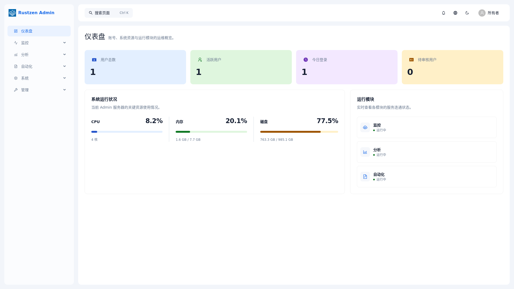
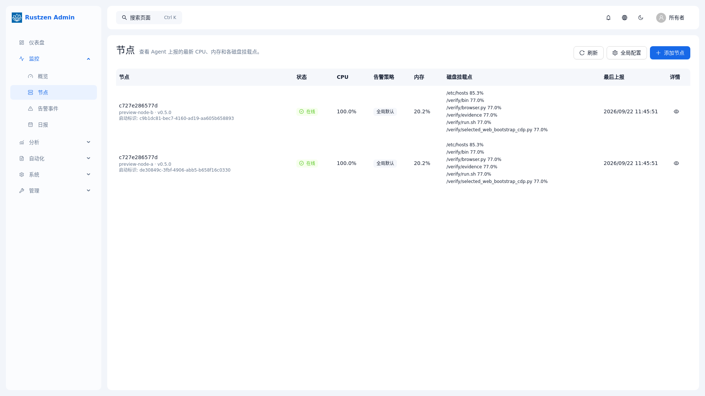
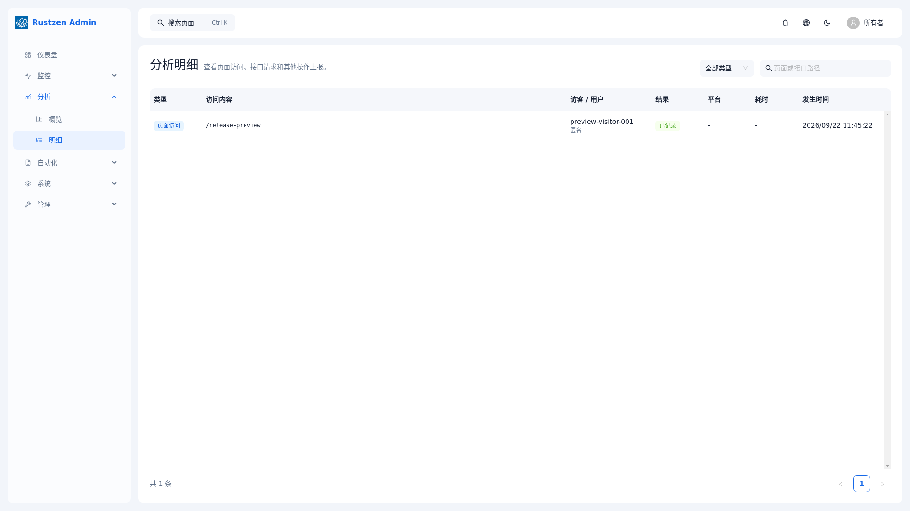
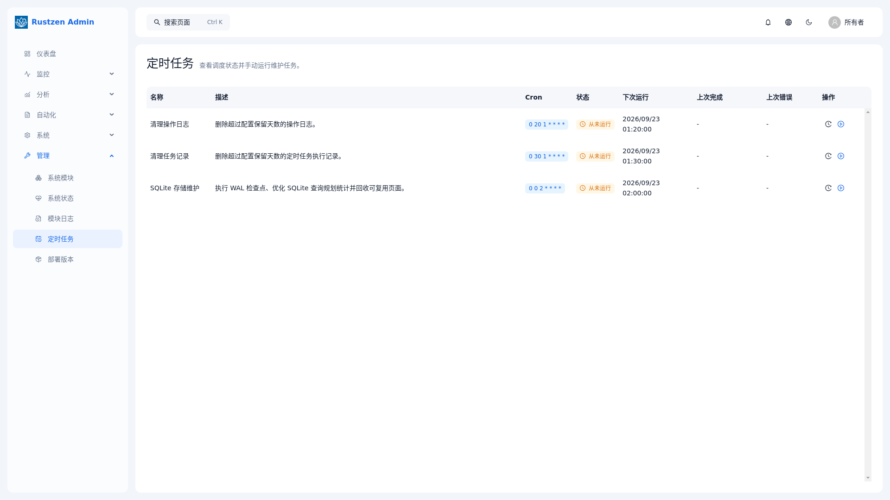

# rustzen-admin

[简体中文](./README.md) | English

`rustzen-admin` provides the Rustzen Admin, Monitor, Insights, and Reports
runtime in one source repository and one signed release bundle.

A lightweight operations and administration product for small self-hosted
environments, and a structured Rust full-stack reference implementation.

> `rustzen-admin` combines an Axum backend, a React frontend, shared crates,
> deployment assets, and repository-level documentation in a single codebase
> designed for clear boundaries, maintainability, and AI-friendly collaboration.

## Overview

`rustzen-admin` is primarily a deployable open-source administration product. It
also keeps a clear, reusable engineering structure for secondary development
and reference use, rather than serving as an isolated UI demo.

The repository is organized as a monorepo:

- `crates/auth/` contains shared auth and permission capabilities for Rust services
- `crates/ipc/` contains shared module response and pagination, health, Manifest, route, and HMAC delegation contracts
- `crates/storage/` contains shared SQLite pool and maintenance primitives
- `apps/admin/` contains the Admin API, gateway, RBAC, release management, and Web asset host
- `apps/monitor/` powers Monitoring and the optional managed-node Agent
- `apps/insights/` powers product Analytics and its public tracker
- `apps/reports/` powers report templates, filling runs, and live execution views
- `apps/cli/` provides the non-resident `rz` operations command
- `apps/web/` contains the React frontend application
- `deploy/` contains deployment assets and release support files
- `docs/` contains repository-level architecture and development guides
- the root keeps shared commands, workspace metadata, and collaboration entry documents

This layout keeps backend, frontend, and repository rules explicit, making the codebase easier to understand, review, and evolve.

## Screenshots

These representative pages were captured at a 1920×1080 browser viewport from the
current full-service candidate running in Linux. All 19 authenticated business routes
have a candidate screenshot; see the [release screenshot index](./docs/assets/screenshots/README.md)
for the complete set and the [local verification record](./docs/guides/local-verification.md)
for the acceptance boundary.

| Dashboard | Monitoring Nodes |
| --- | --- |
|  |  |

| Analytics Details | Automated Report |
| --- | --- |
|  |  |

## Repository Layout

→ Architecture summary: [docs/architecture.md](./docs/architecture.md)

## Product Direction

→ Product positioning, direction, and module boundaries: [docs/product/product.md](./docs/product/product.md)

## Documentation

→ Complete documentation index: [docs/README.md](./docs/README.md)

## Command Source

Use the root `justfile` as the command source of truth; inspect the relevant target before running it.
Local development and test builds retain usable backtraces without generating full
variable-level debug data, which keeps the workspace `target/` directory bounded.

```bash
cargo run -p rustzen-admin -- serve
cargo run -p rustzen-monitor -- controller
cargo run -p rustzen-insights -- serve
cargo run -p rustzen-reports -- serve
cargo run -p rustzen-cli -- --json doctor
```

The release installs `rz` beside the four server binaries under
`/opt/rz/current/bin/`. It is not part of `rz-full.service`, owns no database, and
does not merge the four process or failure boundaries. Its service controls are:

```bash
rz --help
rz start
rz stop
rz restart
rz status
```

For direct systemd inspection, use `systemctl status rz-full`. The canonical unit
name is `rz-full.service`.

There is one production installation path. `just build` creates a signed complete
bundle containing the Web application and all four services. Copy the bundle and
the generated installer to the server, run the installer, then run `rz start`.
Installation does not ask for an administrator password, signing key, verification
key, or database command. Each service creates and validates its own SQLite database
on first start.

Complete build outputs are written to `target/rz/`:

```text
target/rz/rz-<version>-<arch>.tar
target/rz/rz-install
```

Install the two copied files with:

```bash
sudo ./rz-install ./rz-<version>-<arch>.tar
sudo rz start
rz status
```

JSON success responses always contain `schema_version`, `ok`, `command`, and
`data`. CLI failures contain `schema_version`, `ok`, `command`, plus
`error.code` and `error.message`. `doctor` reads only an endpoint allowlist
from configuration; credential keys never enter CLI state and credential
values are never emitted.

Local startup is SQLite-first and does not require PostgreSQL.
SQLite connection primitives, role policy, runtime layout, and logging are owned
inside this repository; there is no `rustzen-core` runtime dependency.
Local development needs no `.env`: database paths, ports, connection-pool
limits, runtime paths, logging, timezone, JWT lifetime, and development-only
JWT/IPC secrets have built-in defaults. Use environment variables only to
override those defaults.

If startup fails with `VersionMismatch`, your local database schema is out-of-date with current migration checksums. Run:

```bash
just reset-db
cargo run -p rustzen-admin -- serve
```

If startup succeeds, the database will be recreated automatically.

## Demo

- Local demo URL: [https://admin.rustzen.dev](https://admin.rustzen.dev)
- Username: `owner`
- Demo password: `rustzen@123`

This public credential is only for the demo environment. A production installation
still generates a random initial password, which the server's root user reads from
`/opt/rz/data/initial-owner-password`; after a password change, use the new password.

## Notes

- `README.md` and `AGENTS.md` stay as lightweight entry documents.
- `docs/history/` contains historical execution records and is not current implementation truth.

## License and Trademark

Source code is licensed under the [Apache License 2.0](./LICENSE.md). Commercial
use, modification, and distribution are permitted subject to that license.
Rustzen names, logos, domains, official package namespaces, and official
distribution channels are not included in the software license. See
[NOTICE.md](./NOTICE.md) and [TRADEMARKS.md](./TRADEMARKS.md).
