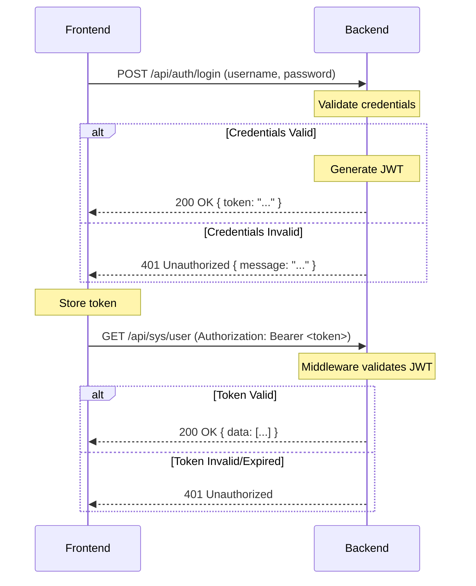

# 🌐 Rustzen Admin API 文档

## 📋 目录

- [基础信息](#基础信息)
- [身份认证](#身份认证)
- [标准响应格式](#标准响应格式)
- [系统管理接口](#系统管理接口)
- [工具接口](#工具接口)
- [接口测试](#接口测试)

---

## 🌐 基础信息

### Base URLs

- **开发环境**: `http://localhost:3001`
- **生产环境**: `https://your-domain.com`

### API 前缀

所有业务接口都使用 `/api` 作为前缀。

---

## 🔐 身份认证

### 认证方式

使用 JWT (JSON Web Token) 进行身份认证：

```http
Authorization: Bearer <your-jwt-token>
```

### 认证流程

认证过程遵循标准的基于令牌的流程：

1. **登录**: 用户向登录端点提交凭据（用户名和密码）
2. **令牌生成**: 如果凭据有效，后端服务器生成 JWT
3. **令牌响应**: 服务器将 JWT 返回给前端
4. **令牌存储**: 前端安全地存储令牌（如 `localStorage`）
5. **认证请求**: 对于所有受保护端点的后续请求，前端在 `Authorization` 头中包含 JWT
6. **令牌验证**: 后端的认证中间件在每个请求上验证 JWT



### 登录接口

#### 用户登录

```http
POST /api/auth/login
```

**请求体**:
```json
{
  "username": "admin",
  "password": "password123"
}
```

**成功响应 (200 OK)**:
```json
{
  "code": 0,
  "message": "success",
  "data": {
    "token": "eyJhbGciOiJIUzI1NiIsInR5cCI6IkpXVCJ9..."
  }
}
```

### JWT 结构

JWT 的载荷包含用户相关的声明：

```json
{
  "sub": 1,                     // 用户 ID
  "username": "admin",          // 用户名
  "roles": ["admin", "editor"], // 用户角色列表
  "exp": 1678886400            // 过期时间戳
}
```

- `sub` (Subject): 用户的唯一标识符
- `exp` (Expiration Time): 令牌失效的时间戳

### 前端处理

- **令牌存储**: 令牌存储在 `localStorage` 中
- **状态管理**: 全局状态（如 Zustand）跟踪认证状态和用户信息
- **请求拦截器**: API 请求处理器自动为所有出站请求附加 `Authorization` 头
- **响应拦截器**: API 响应处理器检查 `401` 响应，在令牌过期时自动登出用户或重定向到登录页面

---

## 📋 标准响应格式

所有接口都使用统一的响应格式：

```typescript
interface ApiResponse<T> {
  code: number;    // 状态码：200 成功，其他为错误码
  message: string; // 响应消息
  data?: T;        // 响应数据（可选）
}
```

### 成功响应示例

```json
{
  "code": 200,
  "message": "success",
  "data": {
    "id": 1,
    "userName": "admin"
  }
}
```

### 错误响应示例

```json
{
  "code": 500,
  "message": "数据库连接失败",
  "data": null
}
```

---

## 🛠️ 系统管理接口

### 用户管理

#### 获取用户列表

```http
GET /api/sys/user
```

**响应示例**:
```json
{
  "code": 200,
  "message": "success",
  "data": [
    {
      "id": 1,
      "userName": "Admin",
      "roleIds": [1]
    }
  ]
}
```

### 角色管理

#### 获取角色列表

```http
GET /api/sys/role
```

### 菜单管理

#### 获取菜单列表

```http
GET /api/sys/menu
```

### 字典管理

#### 获取字典列表

```http
GET /api/sys/dict
```

### 日志管理

#### 获取日志列表

```http
GET /api/sys/log
```

---

## 🔧 工具接口

### 健康检查

```http
GET /health
```

**响应示例**:
```json
{
  "status": "ok",
  "message": "Rustzen Admin Backend is running",
  "version": "0.1.0"
}
```

### 根路径信息

```http
GET /
```

**响应示例**:
```json
{
  "message": "Welcome to Rustzen Admin API",
  "endpoints": {
    "health": "/health",
    "api": "/api"
  }
}
```

---

## 📝 路径约定

- 所有 API 路径**不使用**尾部斜杠（如 `/api/sys/user` 而不是 `/api/sys/user/`）
- 使用小写字母和连字符分隔单词
- 资源名称使用复数形式（如 `users` 而不是 `user`，但当前为了保持一致性暂时使用单数）

---

## 🧪 接口测试

推荐使用 VSCode REST Client 插件进行接口测试：

1. **安装插件**: `REST Client by Huachao Mao`
2. **打开测试文件**: [`api.http`](./api.http)
3. **发送请求**: 点击请求上方的 "Send Request" 按钮
4. **查看使用指南**: [`rest-client.md`](./rest-client.md)

---

## 🚀 快速开始

1. **启动后端服务**:
   ```bash
   cd backend
   cargo run
   ```

2. **测试健康检查**:
   ```bash
   curl http://localhost:3001/health
   ```

3. **测试用户接口**:
   ```bash
   curl http://localhost:3001/api/sys/user
   ```

---

## 📚 相关文档

- [API 测试用例](./api.http) - REST Client 测试文件
- [REST Client 使用指南](./rest-client.md) - 详细的测试工具使用说明
- [项目架构](../architecture.md) - 整体架构设计
- [开发指南](../development/CONTRIBUTING.md) - 贡献代码指南

---

*最后更新: 2025-01-XX*
