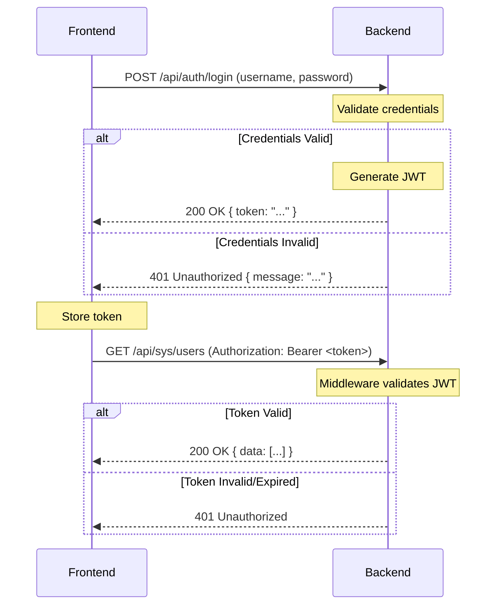

# 🌐 Rustzen Admin API 文档

> **重要说明**: 这是全新系统的 API 接口文档，适用于新项目开发，不涉及 API 迁移或兼容性事项。

## 📋 API 概述

本文档提供了 rustzen-admin 项目的完整 API 接口文档，包括：

1. **接口规范**：统一的请求响应格式和认证方式
2. **功能接口**：7 个核心模块的完整 API 设计
3. **错误处理**：统一的错误码和异常处理机制
4. **调用示例**：详细的接口调用示例和测试用例

**设计特点**：

- **RESTful 风格**：遵循 REST 架构设计原则
- **统一规范**：标准化的接口格式和命名规范
- **安全可靠**：JWT 认证和权限验证机制
- **易于测试**：完整的测试用例和调用示例

---

## 🌐 基础信息

### Base URLs

- **开发环境**: `http://localhost:8000`
- **生产环境**: `https://your-domain.com`

### API 前缀

所有业务接口都使用 `/api` 作为前缀。

---

## 🔐 身份认证

### 认证方式

使用 JWT (JSON Web Token) 进行身份认证：

```http
Authorization: Bearer <your-jwt-token>
```

### 认证流程

认证过程遵循标准的基于令牌的流程：

1. **登录**: 用户向登录端点提交凭据（用户名和密码）
2. **令牌生成**: 如果凭据有效，后端服务器生成 JWT
3. **令牌响应**: 服务器将 JWT 返回给前端
4. **令牌存储**: 前端安全地存储令牌（如 `localStorage`）
5. **认证请求**: 对于所有受保护端点的后续请求，前端在 `Authorization` 头中包含 JWT
6. **令牌验证**: 后端的认证中间件在每个请求上验证 JWT



### JWT 结构

JWT 的载荷包含用户相关的声明：

```json
{
  "sub": 1, // 用户 ID
  "username": "admin", // 用户名
  "roles": ["admin", "editor"], // 用户角色列表
  "exp": 1678886400 // 过期时间戳
}
```

- `sub` (Subject): 用户的唯一标识符
- `exp` (Expiration Time): 令牌失效的时间戳

### 前端处理

- **令牌存储**: 令牌存储在 `localStorage` 中
- **状态管理**: 全局状态（如 Zustand）跟踪认证状态和用户信息
- **请求拦截器**: API 请求处理器自动为所有出站请求附加 `Authorization` 头
- **响应拦截器**: API 响应处理器检查 `401` 响应，在令牌过期时自动登出用户或重定向到登录页面

---

## 📋 统一响应格式

所有接口都使用统一的响应格式：

### 基础响应格式

```typescript
interface ApiResponse<T> {
  code: number; // 状态码：200 成功，其他为错误码
  message: string; // 响应消息
  data?: T; // 响应数据（可选）
  timestamp: number; // 时间戳
}
```

### 分页响应格式

```typescript
interface PageResponse<T> {
  code: number;
  message: string;
  data: {
    list: T[]; // 数据列表
    total: number; // 总记录数
    page: number; // 当前页码
    page_size: number; // 每页大小
  };
  timestamp: number;
}
```

### 成功响应示例

```json
{
  "code": 200,
  "message": "操作成功",
  "data": {
    "id": 1,
    "username": "admin"
  },
  "timestamp": 1672531200
}
```

### 分页响应示例

```json
{
  "code": 200,
  "message": "获取成功",
  "data": {
    "list": [
      {
        "id": 1,
        "username": "admin"
      }
    ],
    "total": 1,
    "page": 1,
    "page_size": 10
  },
  "timestamp": 1672531200
}
```

### 错误响应示例

```json
{
  "code": 500,
  "message": "数据库连接失败",
  "data": null,
  "timestamp": 1672531200
}
```

---

## 📚 API 模块导航

### 🔐 [认证授权接口](./auth.md)

- 用户登录/登出
- Token 刷新
- 用户信息获取

### 👥 [用户管理接口](./user.md)

- 用户 CRUD 操作
- 用户状态管理
- 用户角色分配

### 🛡️ [角色管理接口](./role.md)

- 角色 CRUD 操作
- 角色权限分配
- 角色状态管理

### 🔑 [权限管理接口](./permission.md)

- 权限 CRUD 操作
- 权限树结构
- 权限状态管理

### 📋 [菜单管理接口](./menu.md)

- 菜单 CRUD 操作
- 菜单树结构
- 菜单权限关联

### 📖 [字典管理接口](./dict.md)

- 字典 CRUD 操作
- 字典分类管理
- 字典缓存机制

### 📊 [系统日志接口](./log.md)

- 操作日志查询
- 日志统计分析
- 日志导出功能

---

## ❌ 错误码定义

### 通用错误码

| 错误码 | 说明           | HTTP 状态码 |
| ------ | -------------- | ----------- |
| 200    | 操作成功       | 200         |
| 400    | 请求参数错误   | 400         |
| 401    | 未授权访问     | 401         |
| 403    | 权限不足       | 403         |
| 404    | 资源不存在     | 404         |
| 500    | 服务器内部错误 | 500         |

### 业务错误码

| 错误码 | 说明             | 模块 |
| ------ | ---------------- | ---- |
| 1001   | 用户名或密码错误 | 认证 |
| 1002   | 用户已被禁用     | 认证 |
| 1003   | Token 已过期     | 认证 |
| 2001   | 用户名已存在     | 用户 |
| 2002   | 邮箱已存在       | 用户 |
| 3001   | 角色名已存在     | 角色 |
| 3002   | 角色正在使用中   | 角色 |
| 4001   | 权限代码已存在   | 权限 |
| 5001   | 菜单代码已存在   | 菜单 |
| 6001   | 字典类型已存在   | 字典 |

---

## 🧪 接口测试

### VSCode REST Client

我们推荐使用 **VSCode REST Client** 进行 API 测试：

1. **安装插件**: 在 VSCode 扩展中搜索 "REST Client"
2. **打开测试文件**: [`api.http`](./api.http)
3. **发送请求**: 点击任何 HTTP 请求上方的 "Send Request"
4. **查看响应**: 结果会在新标签页中显示

**主要优势**:

- ✅ 与 VSCode 集成
- ✅ 支持 Git 版本控制
- ✅ 适合个人开发
- ✅ 无需额外软件

查看完整指南: [REST Client 使用指南](./rest-client.md)

### 调用示例

#### curl 示例

```bash
# 用户登录
curl -X POST http://localhost:8000/api/auth/login \
  -H "Content-Type: application/json" \
  -d '{"username":"admin","password":"admin123"}'

# 获取用户列表
curl -X GET http://localhost:8000/api/sys/users \
  -H "Authorization: Bearer YOUR_TOKEN"
```

#### JavaScript 示例

```javascript
// 用户登录
const loginResponse = await fetch("/api/auth/login", {
  method: "POST",
  headers: {
    "Content-Type": "application/json",
  },
  body: JSON.stringify({
    username: "admin",
    password: "admin123",
  }),
});

const loginData = await loginResponse.json();
const token = loginData.data.access_token;

// 获取用户列表
const usersResponse = await fetch("/api/sys/users", {
  headers: {
    Authorization: `Bearer ${token}`,
  },
});

const usersData = await usersResponse.json();
```

---

_API 文档总览 v1.0_  
_最后更新: 2025-01-XX_
