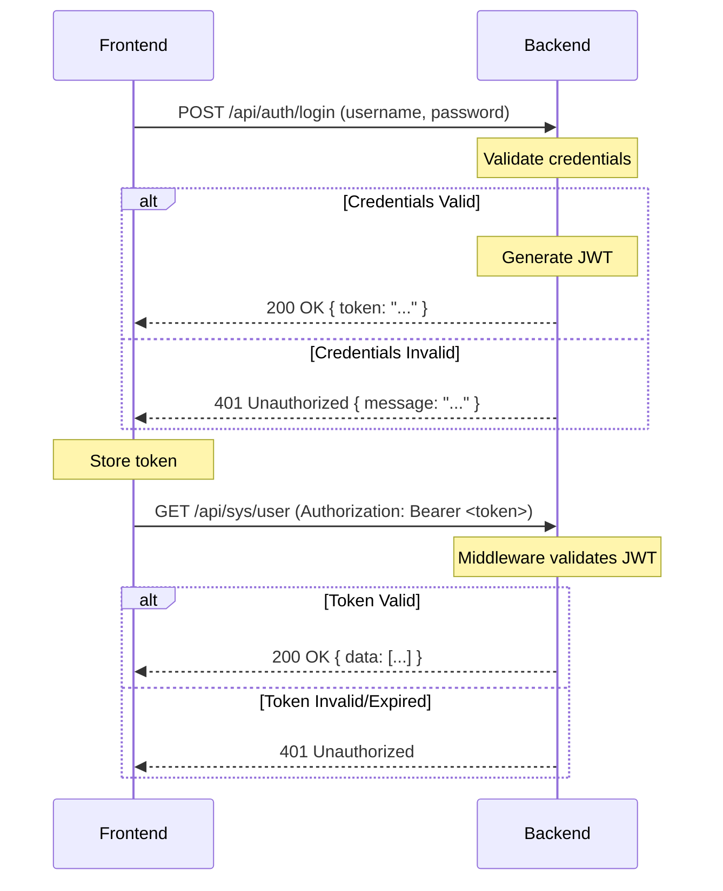

# 🔐 Authentication Guide

This document details the authentication flow for `rustzen-admin`, based on JSON Web Tokens (JWT).

---

## Authentication Flow

The authentication process follows a standard token-based flow:

1.  **Login**: The user submits their credentials (e.g., username and password) to the login endpoint.
2.  **Token Generation**: If the credentials are valid, the backend server generates a JWT.
3.  **Token Response**: The server returns the JWT to the frontend.
4.  **Token Storage**: The frontend securely stores the token (e.g., in `localStorage` or a secure cookie).
5.  **Authenticated Requests**: For all subsequent requests to protected endpoints, the frontend includes the JWT in the `Authorization` header.
6.  **Token Validation**: The backend's authentication middleware validates the JWT on each request. If valid, the request is processed; otherwise, a `401 Unauthorized` error is returned.



---

## Endpoints

### Login

- **Endpoint**: `POST /api/auth/login`
- **Request Body**:
  ```json
  {
    "username": "admin",
    "password": "password123"
  }
  ```
- **Success Response (`200 OK`)**:
  ```json
  {
    "code": 0,
    "message": "success",
    "data": {
      "token": "eyJhbGciOiJIUzI1NiIsInR5cCI6IkpXVCJ9..."
    }
  }
  ```

---

## JWT Structure (Payload)

The payload of the JWT contains claims about the user. While the exact structure can evolve, it will typically include:

```json
{
  "sub": 1, // User ID
  "username": "admin",
  "roles": ["admin", "editor"], // List of user roles
  "exp": 1678886400 // Expiration timestamp
}
```

- `sub` (Subject): The unique identifier for the user.
- `exp` (Expiration Time): The timestamp after which the token will be invalid.

The frontend should **not** rely on the payload for critical security decisions but can use it for UI display purposes (e.g., showing the username).

---

## Frontend Handling

- **Token Storage**: The token is stored in `localStorage`.
- **State Management**: A global state (e.g., in Zustand) tracks the authentication status and user information.
- **Request Interceptor**: An API request handler (interceptor) automatically attaches the `Authorization` header to all outgoing requests.
- **Response Interceptor**: An API response handler checks for `401` responses to automatically log the user out or redirect to the login page if a token expires.
