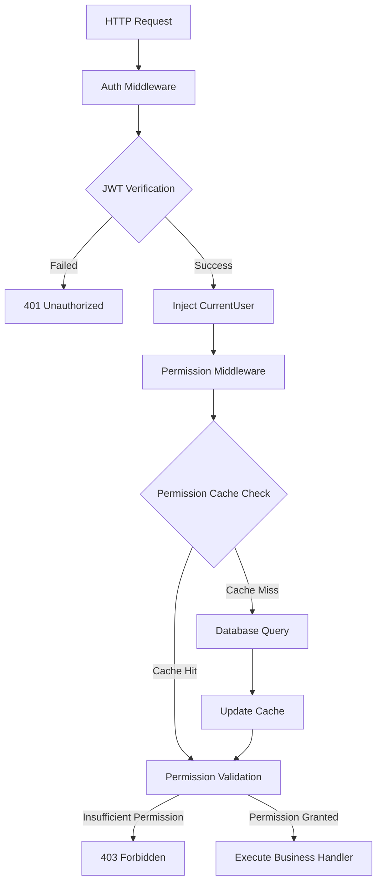

# rustzen-admin Series (Part 2): Permission System Architecture - Complete Implementation of Declarative Permission System Based on Axum

> This article introduces a modern permission system design and implementation based on the Rust Axum framework, focusing on how to build a high-performance, maintainable permission control system through declarative APIs, intelligent caching, and middleware architecture.

---

## I. Introduction: Why Design a Unified Permission System?

In modern web application development, permission control is an unavoidable core requirement. As business complexity grows, we face the following challenges:

### 🔍 Pain Points of Traditional Permission Control

**Scattered Permission Checks**: Each API endpoint requires manual permission checking code

```rust
// ❌ Traditional approach: Every handler needs repeated permission checks
async fn user_list_handler(current_user: CurrentUser) -> Result<Json<Vec<User>>, AppError> {
    if !current_user.has_permission("system:user:list") {
        return Err(AppError::PermissionDenied);
    }
    // Business logic...
}
```

**Maintenance Difficulties**: Permission logic scattered everywhere, hard to manage and debug uniformly

**Performance Issues**: Every request requires database queries to fetch permission information

**Security Risks**: Easy to miss permission checks or have inconsistent permission logic

### 🎯 Our Solution

Design a **centralized, declarative, high-performance** permission system that implements:

- ✅ Declare permission requirements during route registration
- ✅ Unified permission validation through middleware
- ✅ Intelligent caching to reduce database queries
- ✅ Flexible permission combination logic

---

## II. Design Goals and Principles

### 🎯 Core Goals of Permission System

1. **Centralized Permission Declaration**: Permission binding completed during route registration phase, clear at a glance
2. **Unified Middleware Validation**: All permission validation logic centralized in middleware layer
3. **Automatic User Information Injection**: No need for manual user identity handling
4. **Cache Optimization**: Avoid repeated queries, support intelligent refresh

### ✅ Design Principles

**Minimal Coupling**: Complete separation of Authentication and Authorization

```rust
// Authentication middleware: Only responsible for identity verification
pub async fn auth_middleware(/* ... */) -> Result<Response, AppError>

// Permission middleware: Only responsible for permission checking
async fn permission_middleware(/* ... */) -> Result<Response, AppError>
```

**Extensibility**: Support single permission, any permission, all permissions and other combination modes

**High Performance**: In-memory caching + expiration refresh, minimize database access

**Clean and Readable**: Developer-friendly declarative API

---

## III. Permission System Architecture Overview

### 🔄 Complete Request Processing Flow



### 🏗️ Module Architecture Design

| Module                 | File                   | Responsibility                                           |
| ---------------------- | ---------------------- | -------------------------------------------------------- |
| **JWT Authentication** | `core/jwt.rs`          | Token generation, verification, Claims parsing           |
| **User Extraction**    | `auth/extractor.rs`    | CurrentUser structure definition and extraction logic    |
| **Auth Middleware**    | `auth/middleware.rs`   | JWT verification, user information injection             |
| **Permission Cache**   | `auth/permission.rs`   | Permission cache management, permission validation logic |
| **Router Extension**   | `common/router_ext.rs` | Declarative permission binding API                       |

---

## IV. Core Module Details

### 4.1 JWT Authentication Module

**Design Philosophy**: JWT only handles identity recognition, does not carry permission information

```rust
#[derive(Debug, Serialize, Deserialize, Clone)]
pub struct Claims {
    pub user_id: i64,      // User unique identifier
    pub username: String,  // Username
    pub exp: usize,        // Expiration time
    pub iat: usize,        // Issued at time
}
```

**Key Features**:

- 🔧 Environment variable configuration for secret key and expiration time
- 🛡️ Default value warnings to avoid production environment security risks
- ⚡ High-performance token verification

```rust
pub fn verify_token(token: &str) -> Result<Claims, jsonwebtoken::errors::Error> {
    let validation = Validation::new(Algorithm::HS256);
    let token_data = decode::<Claims>(
        token,
        &DecodingKey::from_secret(JWT_CONFIG.secret.as_bytes()),
        &validation,
    )?;
    Ok(token_data.claims)
}
```

### 4.2 User Information Extractor `CurrentUser`

**Design Highlight**: Implements Axum's `FromRequestParts`, supports dependency injection

#### 📋 CurrentUser vs Claims Semantic Differences

| Concept         | Purpose                         | Lifecycle             | Information Contained      |
| --------------- | ------------------------------- | --------------------- | -------------------------- |
| **Claims**      | JWT Token payload data          | Token validity period | Basic identity information |
| **CurrentUser** | Business layer user abstraction | Single request        | Verified user information  |

```rust
// Claims: Raw data after JWT parsing, only used for authentication
#[derive(Debug, Serialize, Deserialize, Clone)]
pub struct Claims {
    pub user_id: i64,
    pub username: String,
    pub exp: usize,
    pub iat: usize,
}

// CurrentUser: Unified business layer user structure for dependency injection
#[derive(Debug, Clone, Serialize, Deserialize)]
pub struct CurrentUser {
    pub user_id: i64,
    pub username: String,
}

// 🎯 Key: Implement FromRequestParts for automatic extraction
impl<S> FromRequestParts<S> for CurrentUser
where S: Send + Sync,
{
    type Rejection = AppError;

    fn from_request_parts(/* ... */) -> impl Future<Output = Result<Self, Self::Rejection>> {
        // Get user information from request extensions
        // Data comes from authentication middleware parsing Claims and injecting information
    }
}
```

**Design Principles**:

- **Claims only for authentication**: JWT parsing followed by immediate conversion, not used directly in business code
- **CurrentUser is unified business structure**: All handlers use uniformly, ensuring type safety

**Usage**:

```rust
// ✅ Extract current user information
async fn user_profile_handler(current_user: CurrentUser) -> Json<UserProfile> {
    // current_user automatically injected, contains user_id and username
}

// 🔧 Uniformly use CurrentUser to extract user information
async fn get_user_info_handler(
    current_user: CurrentUser,  // Automatically inject current user information
    State(pool): State<PgPool>,
) -> AppResult<Json<ApiResponse<UserInfoResponse>>> {
    let user_info = AuthService::get_user_info(&pool, current_user.user_id, &current_user.username).await?;
    Ok(ApiResponse::success(user_info))
}
```

### 4.3 Intelligent Permission Caching Mechanism

**Core Design**: In-memory cache + expiration refresh + thread safety

```rust
/// Permission cache entry with expiration time
#[derive(Debug, Clone)]
pub struct UserPermissionCache {
    pub permissions: HashSet<String>,  // User permission set
    pub cached_at: DateTime<Utc>,      // Cache time
}

/// Global cache manager, thread-safe
pub struct PermissionCacheManager {
    cache: Arc<RwLock<HashMap<i64, UserPermissionCache>>>,
}
```

**Intelligent Refresh Strategy**:

```rust
pub async fn get_cached_permissions(
    pool: &PgPool,
    user_id: i64,
) -> Result<Option<UserPermissionCache>, ServiceError> {
    if let Some(cache) = PERMISSION_CACHE.get(user_id) {
        if cache.is_expired() {
            // 🔄 Cache expired, automatically refresh from database
            let new_cache = Self::load_user_permissions_from_db(pool, user_id).await?;
            return Ok(Some(new_cache));
        }
        return Ok(Some(cache));
    }
    Ok(None)
}
```

**Performance Optimization**:

- ⚡ Read-write lock for high-concurrency access
- 🕐 1-hour cache expiration time, balancing performance and real-time
- 🔄 Automatic reload on cache expiration, transparent to users

---

## V. Declarative Route Permission Binding Design

### 5.1 RouterExt Trait Design

**Core Innovation**: Extend Axum Router to support permission declaration

```rust
pub trait RouterExt<S> {
    fn route_with_permission(
        self,
        path: &str,
        method_router: MethodRouter<S>,
        permissions_check: PermissionsCheck,  // 🎯 Core: Permission check configuration
    ) -> Self;
}
```

**Implementation Principle**:

```rust
impl RouterExt<PgPool> for Router<PgPool> {
    fn route_with_permission(self, path: &str, method_router: MethodRouter<PgPool>, permissions_check: PermissionsCheck) -> Self {
        self.route(
            path,
            method_router.layer(axum::middleware::from_fn(move |req: Request, next: Next| {
                let permissions_check = permissions_check.clone();
                async move { permission_middleware(req, next, permissions_check).await }
            })),
        )
    }
}
```

### 5.2 Flexible Permission Check Modes

**PermissionsCheck Enum**: Support multiple permission combination logic

```rust
#[derive(Debug, Clone)]
pub enum PermissionsCheck {
    Single(&'static str),           // Single permission
    Any(Vec<&'static str>),        // Any permission (OR logic)
    All(Vec<&'static str>),        // All permissions (AND logic)
}
```

**Usage Examples**:

```rust
// 🔹 Single permission check
router.route_with_permission(
    "/system/users",
    get(user_list_handler),
    PermissionsCheck::Single("system:user:list")
)

// 🔹 Any permission check (admin or user admin can access)
router.route_with_permission(
    "/system/users",
    post(create_user_handler),
    PermissionsCheck::Any(vec!["admin:all", "system:user:create"])
)

// 🔹 All permissions check (requires delete permission AND confirm permission)
router.route_with_permission(
    "/system/users/{id}",
    delete(delete_user_handler),
    PermissionsCheck::All(vec!["system:user:delete", "system:confirm"])
)
```

### 5.3 Permission Middleware Core Logic

**Unified Permission Validation Flow**:

```rust
async fn permission_middleware(
    request: Request,
    next: Next,
    permissions_check: PermissionsCheck,
) -> Result<Response, AppError> {
    // 1️⃣ Get current user (injected by auth middleware)
    let current_user = request.extensions().get::<CurrentUser>()
        .ok_or(AppError::from(ServiceError::InvalidCredentials))?;

    // 2️⃣ Get database connection pool
    let pool = request.extensions().get::<PgPool>()
        .ok_or(AppError::from(ServiceError::DatabaseQueryFailed))?;

    // 3️⃣ Check permissions (cache first)
    let has_permission = PermissionService::check_permissions(
        &pool,
        current_user.user_id,
        &permissions_check
    ).await?;

    // 4️⃣ Deny access if insufficient permissions
    if !has_permission {
        return Err(AppError::from(ServiceError::PermissionDenied));
    }

    // 5️⃣ Permission granted, continue execution
    Ok(next.run(request).await)
}
```

---

## VI. Permission Cache and JWT Collaboration Mechanism

### 6.1 Dual-Layer Cache Design

| Cache Type           | Storage Location | Expiration Time | Refresh Mechanism      | Purpose                 |
| -------------------- | ---------------- | --------------- | ---------------------- | ----------------------- |
| **JWT Token**        | Client           | 1-2 hours       | Re-login on expiration | Identity authentication |
| **Permission Cache** | Server memory    | 1 hour          | Auto refresh           | Permission validation   |

### 6.2 Cache Collaboration Flow

**Cache Permissions on Login**:

```rust
// Login triggers permission caching
pub async fn login(pool: &PgPool, request: LoginRequest) -> Result<LoginResponse, ServiceError> {
    let user = Self::verify_login(pool, &request.username, &request.password).await?;
    let token = jwt::generate_token(user.id, &user.username)?;

    // Getting user info automatically caches permissions
    let user_info = Self::get_user_info(pool, user.id, &user.username).await?;
    Ok(LoginResponse { token, user_info })
}

// 🎯 Key location for permission caching
pub async fn get_user_info(pool: &PgPool, user_id: i64, username: &str) -> Result<UserInfoResponse, ServiceError> {
    // Query user permissions
    let permissions = UserRepository::get_user_permissions(pool, user_id).await?;

    // 🎯 Cache permissions to memory (1 hour validity)
    PermissionService::cache_user_permissions(user_id, permissions);

    // Return user info...
}
```

**Cache Strategy for Permission Checking**:

```rust
pub async fn check_permissions(
    pool: &PgPool,
    user_id: i64,
    permissions_check: &PermissionsCheck,
) -> Result<bool, ServiceError> {
    // 🔍 Try to get permissions from cache
    if let Some(cache) = Self::get_cached_permissions(pool, user_id).await? {
        return Ok(permissions_check.check(&cache.permissions));
    }

    // 🚫 Cache miss, require re-authentication
    // Design rationale: This shouldn't happen in normal business flow,
    // if it occurs, it indicates system anomaly, deny access for security
    // Supports logout after user prohibition/deletion
    Err(ServiceError::InvalidCredentials)
}
```

### 6.3 Cache Invalidation and Security

**Key Scenarios for Active Cache Clearing**:

```rust
// 1️⃣ Clear permission cache on logout
async fn logout_handler(current_user: CurrentUser) -> AppResult<Json<ApiResponse<()>>> {
    PermissionService::clear_user_cache(current_user.user_id);
    Ok(ApiResponse::success(()))
}

// 2️⃣ Clear cache when deleting user
pub async fn delete_user(pool: &PgPool, id: i64) -> Result<(), ServiceError> {
    let deleted = UserRepository::soft_delete(pool, id).await?;
    if !deleted {
        return Err(ServiceError::NotFound("User not found".to_string()));
    }

    // 🎯 Key: Clear user's permission cache when deleting user
    PermissionService::clear_user_cache(id);
    tracing::info!("Deleted user {} and cleared associated cache", id);

    Ok(())
}

// 3️⃣ Clear cache when user roles change
pub async fn update_user(/* ... */) -> Result<UserResponse, ServiceError> {
    // When updating user roles
    if let Some(role_ids) = request.role_ids {
        UserRepository::set_user_roles(pool, updated_user.id, &role_ids).await?;

        // 🎯 Clear permission cache after role change, force reload
        PermissionService::clear_user_cache(updated_user.id);
        tracing::info!("Updated user {} roles and cleared permission cache", updated_user.id);
    }

    // When user status changes (especially disabling user)
    if let Some(new_status) = request.status {
        if new_status != user.status {
            PermissionService::clear_user_cache(updated_user.id);
            tracing::info!("Updated user {} status and cleared permission cache", updated_user.id);
        }
    }
}
```

**Cache Security Strategy**:

- ✅ **User Deletion**: Immediately clear permission cache to prevent permission residue of deleted users
- ✅ **Role Changes**: Clear cache after user role modification to ensure new permissions take effect
- ✅ **Status Changes**: Clear cache after user disabling to prevent disabled users from continued access
- ✅ **Active Logout**: Clear cache on user logout to enhance security

---

## VII. Practical Usage Examples

### 7.1 System Management Module Route Configuration

```rust
pub fn system_routes() -> Router<PgPool> {
    Router::new()
        // User management
        .route_with_permission(
            "/users",
            get(user_list_handler),
            PermissionsCheck::Single("system:user:list")
        )
        .route_with_permission(
            "/users",
            post(create_user_handler),
            PermissionsCheck::Single("system:user:create")
        )
        .route_with_permission(
            "/users/{id}",
            put(update_user_handler),
            PermissionsCheck::Single("system:user:update")
        )
        .route_with_permission(
            "/users/{id}",
            delete(delete_user_handler),
            PermissionsCheck::All(vec!["system:user:delete", "system:confirm"])
        )

        // Role management
        .route_with_permission(
            "/roles",
            get(role_list_handler),
            PermissionsCheck::Any(vec!["system:role:list", "admin:all"])
        )
}
```

### 7.2 Handler Implementation

```rust
// ✅ Handler focuses on business logic, no need to worry about permission checks
async fn user_list_handler(
    current_user: CurrentUser,  // Automatically injected current user
    State(pool): State<PgPool>,
) -> AppResult<Json<ApiResponse<Vec<UserResponse>>>> {
    // Permission already checked at middleware layer, handle business logic directly here
    let users = UserService::list_users(&pool).await?;
    Ok(ApiResponse::success(users))
}

async fn delete_user_handler(
    current_user: CurrentUser,
    State(pool): State<PgPool>,
    Path(user_id): Path<i64>,
) -> AppResult<Json<ApiResponse<()>>> {
    // Permission check: requires system:user:delete AND system:confirm
    // Already declared at route layer, middleware handles automatically
    UserService::delete_user(&pool, user_id).await?;
    Ok(ApiResponse::success(()))
}
```

---

## VIII. Summary

### 🎯 Multiple Benefits from Core Design

**Declarative Permission Binding Design**:

- ✅ Development Efficiency: Reduce repetitive code writing
- ✅ Maintainability: Permission requirements clear at a glance
- ✅ Extensibility: Support flexible permission combinations

**Intelligent Caching Mechanism**:

- ✅ Performance Optimization: Reduce database queries, improve response speed
- ✅ Security Assurance: Support active clearing, permission changes take effect immediately
- ✅ Extensibility: Can be replaced with external caches like Redis

**Unified Middleware Processing**:

- ✅ Development Efficiency: Automatic user information injection
- ✅ Security: Centralized permission control, avoid omissions
- ✅ Maintainability: Unified permission logic management

### 📊 Overall Effect

| Design Feature     | Development Efficiency | Performance Optimization | Security Assurance | Maintainability | Extensibility |
| ------------------ | ---------------------- | ------------------------ | ------------------ | --------------- | ------------- |
| Declarative API    | ✅                     | -                        | ✅                 | ✅              | ✅            |
| Intelligent Cache  | -                      | ✅                       | ✅                 | -               | ✅            |
| Unified Middleware | ✅                     | -                        | ✅                 | ✅              | -             |
| Modular Design     | ✅                     | -                        | -                  | ✅              | ✅            |

📌 **View Project Entry Point and Complete Integration Example**: [main.rs on GitHub](https://github.com/idaibin/rustzen-admin/blob/main/backend/src/main.rs)
