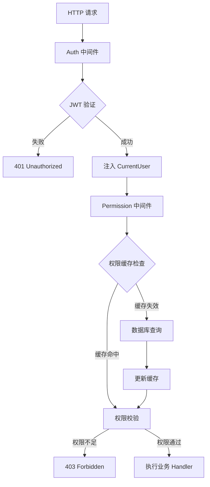

# rustzen-admin 系列（第二篇）：权限架构设计 - 基于 Axum 的声明式权限系统完整实现

> 本文介绍了一个基于 Rust Axum 框架的现代化权限系统设计与实现，重点展示了如何通过声明式 API、智能缓存和中间件架构构建高性能、可维护的权限控制系统。

---

## 一、引言：为什么要设计一个统一权限系统？

在现代 Web 应用开发中，权限控制是一个不可避免的核心需求。随着业务复杂度的增长，我们面临着以下挑战：

### 🔍 传统权限控制的痛点

**分散式权限判断**：每个 API 端点都需要手动编写权限检查代码

```rust
// ❌ 传统做法：每个 handler 都要重复权限检查
async fn user_list_handler(current_user: CurrentUser) -> Result<Json<Vec<User>>, AppError> {
    if !current_user.has_permission("system:user:list") {
        return Err(AppError::PermissionDenied);
    }
    // 业务逻辑...
}
```

**维护困难**：权限逻辑散落在各处，难以统一管理和调试

**性能问题**：每次请求都要查询数据库获取权限信息

**安全风险**：容易遗漏权限检查，或者权限判断逻辑不一致

### 🎯 我们的解决方案

设计一个**集中、声明式、高性能**的权限系统，实现：

- ✅ 路由注册时声明权限要求
- ✅ 中间件统一处理权限校验
- ✅ 智能缓存减少数据库查询
- ✅ 灵活的权限组合逻辑

---

## 二、设计目标与原则

### 🎯 权限系统核心目标

1. **集中式声明权限**：权限绑定在路由注册阶段完成，一目了然
2. **中间件统一校验**：所有权限校验逻辑集中在中间件层
3. **自动注入用户信息**：无需手动处理用户身份识别
4. **缓存优化**：避免重复查询，支持智能刷新

### ✅ 设计原则

**最小耦合**：认证（Authentication）与授权（Authorization）完全分离

```rust
// 认证中间件：只负责验证身份
pub async fn auth_middleware(/* ... */) -> Result<Response, AppError>

// 权限中间件：只负责检查权限
async fn permission_middleware(/* ... */) -> Result<Response, AppError>
```

**可扩展性**：支持单一权限、任意权限、全部权限等多种组合模式

**高性能**：内存缓存 + 过期刷新，最小化数据库访问

**简洁可读**：开发者友好的声明式 API

---

## 三、权限系统架构总览

### 🔄 完整请求处理流程



### 🏗️ 模块架构设计

| 模块           | 文件                   | 职责                           |
| -------------- | ---------------------- | ------------------------------ |
| **JWT 认证**   | `core/jwt.rs`          | Token 生成、验证、Claims 解析  |
| **用户提取**   | `auth/extractor.rs`    | CurrentUser 结构定义与提取逻辑 |
| **认证中间件** | `auth/middleware.rs`   | JWT 验证、用户信息注入         |
| **权限缓存**   | `auth/permission.rs`   | 权限缓存管理、权限校验逻辑     |
| **路由扩展**   | `common/router_ext.rs` | 声明式权限绑定 API             |

---

## 四、核心模块详解

### 4.1 JWT 身份认证模块

**设计理念**：JWT 只负责身份识别，不承载权限信息

```rust
#[derive(Debug, Serialize, Deserialize, Clone)]
pub struct Claims {
    pub user_id: i64,      // 用户唯一标识
    pub username: String,  // 用户名
    pub exp: usize,        // 过期时间
    pub iat: usize,        // 签发时间
}
```

**关键特性**：

- 🔧 环境变量配置密钥和过期时间
- 🛡️ 默认值警告，避免生产环境安全风险
- ⚡ 高性能的 token 验证

```rust
pub fn verify_token(token: &str) -> Result<Claims, jsonwebtoken::errors::Error> {
    let validation = Validation::new(Algorithm::HS256);
    let token_data = decode::<Claims>(
        token,
        &DecodingKey::from_secret(JWT_CONFIG.secret.as_bytes()),
        &validation,
    )?;
    Ok(token_data.claims)
}
```

### 4.2 用户信息提取器 `CurrentUser`

**设计亮点**：实现 Axum 的 `FromRequestParts`，支持依赖注入

#### 📋 CurrentUser vs Claims 语义区别

| 概念            | 用途                 | 生命周期       | 包含信息           |
| --------------- | -------------------- | -------------- | ------------------ |
| **Claims**      | JWT Token 的载荷数据 | Token 有效期内 | 基础身份信息       |
| **CurrentUser** | 业务层的用户抽象     | 单次请求内     | 经过验证的用户信息 |

```rust
// Claims: JWT 解析后的原始数据，仅用于身份验证
#[derive(Debug, Serialize, Deserialize, Clone)]
pub struct Claims {
    pub user_id: i64,
    pub username: String,
    pub exp: usize,
    pub iat: usize,
}

// CurrentUser: 业务层统一的用户结构体，用于依赖注入
#[derive(Debug, Clone, Serialize, Deserialize)]
pub struct CurrentUser {
    pub user_id: i64,
    pub username: String,
}

// 🎯 关键：实现 FromRequestParts，支持自动提取
impl<S> FromRequestParts<S> for CurrentUser
where S: Send + Sync,
{
    type Rejection = AppError;

    fn from_request_parts(/* ... */) -> impl Future<Output = Result<Self, Self::Rejection>> {
        // 从 request extensions 中获取用户信息
        // 这里的数据来源于认证中间件解析 Claims 后注入的信息
    }
}
```

**设计原则**：

- **Claims 仅用于认证**：JWT 解析后立即转换，不在业务代码中直接使用
- **CurrentUser 是统一业务结构体**：所有 Handler 统一使用，确保类型安全

**使用方式**：

```rust
// ✅ 提取当前用户信息
async fn user_profile_handler(current_user: CurrentUser) -> Json<UserProfile> {
    // current_user 自动注入，包含 user_id 和 username
}

// 🔧 统一使用 CurrentUser 提取用户信息
async fn get_user_info_handler(
    current_user: CurrentUser,  // 自动注入当前用户信息
    State(pool): State<PgPool>,
) -> AppResult<Json<ApiResponse<UserInfoResponse>>> {
    let user_info = AuthService::get_user_info(&pool, current_user.user_id, &current_user.username).await?;
    Ok(ApiResponse::success(user_info))
}
```

### 4.3 智能权限缓存机制

**核心设计**：内存缓存 + 过期刷新 + 线程安全

```rust
/// 权限缓存条目，带过期时间
#[derive(Debug, Clone)]
pub struct UserPermissionCache {
    pub permissions: HashSet<String>,  // 用户权限集合
    pub cached_at: DateTime<Utc>,      // 缓存时间
}

/// 全局缓存管理器，线程安全
pub struct PermissionCacheManager {
    cache: Arc<RwLock<HashMap<i64, UserPermissionCache>>>,
}
```

**智能刷新策略**：

```rust
pub async fn get_cached_permissions(
    pool: &PgPool,
    user_id: i64,
) -> Result<Option<UserPermissionCache>, ServiceError> {
    if let Some(cache) = PERMISSION_CACHE.get(user_id) {
        if cache.is_expired() {
            // 🔄 缓存过期，自动从数据库刷新
            let new_cache = Self::load_user_permissions_from_db(pool, user_id).await?;
            return Ok(Some(new_cache));
        }
        return Ok(Some(cache));
    }
    Ok(None)
}
```

**性能优化**：

- ⚡ 读写锁实现高并发访问
- 🕐 1 小时缓存过期时间，平衡性能与实时性
- 🔄 缓存失效时自动重新加载，用户无感知

---

## 五、声明式路由权限绑定设计

### 5.1 RouterExt Trait 设计

**核心创新**：扩展 Axum Router，支持权限声明

```rust
pub trait RouterExt<S> {
    fn route_with_permission(
        self,
        path: &str,
        method_router: MethodRouter<S>,
        permissions_check: PermissionsCheck,  // 🎯 核心：权限检查配置
    ) -> Self;
}
```

**实现原理**：

```rust
impl RouterExt<PgPool> for Router<PgPool> {
    fn route_with_permission(self, path: &str, method_router: MethodRouter<PgPool>, permissions_check: PermissionsCheck) -> Self {
        self.route(
            path,
            method_router.layer(axum::middleware::from_fn(move |req: Request, next: Next| {
                let permissions_check = permissions_check.clone();
                async move { permission_middleware(req, next, permissions_check).await }
            })),
        )
    }
}
```

### 5.2 灵活的权限检查模式

**PermissionsCheck 枚举**：支持多种权限组合逻辑

```rust
#[derive(Debug, Clone)]
pub enum PermissionsCheck {
    Single(&'static str),           // 单一权限
    Any(Vec<&'static str>),        // 任意一个权限（OR 逻辑）
    All(Vec<&'static str>),        // 全部权限（AND 逻辑）
}
```

**使用示例**：

```rust
// 🔹 单一权限检查
router.route_with_permission(
    "/system/users",
    get(user_list_handler),
    PermissionsCheck::Single("system:user:list")
)

// 🔹 任意权限检查（管理员或用户管理员都可以）
router.route_with_permission(
    "/system/users",
    post(create_user_handler),
    PermissionsCheck::Any(vec!["admin:all", "system:user:create"])
)

// 🔹 全部权限检查（需要删除权限且需要确认权限）
router.route_with_permission(
    "/system/users/{id}",
    delete(delete_user_handler),
    PermissionsCheck::All(vec!["system:user:delete", "system:confirm"])
)
```

### 5.3 权限中间件核心逻辑

**统一权限校验流程**：

```rust
async fn permission_middleware(
    request: Request,
    next: Next,
    permissions_check: PermissionsCheck,
) -> Result<Response, AppError> {
    // 1️⃣ 获取当前用户（由 auth 中间件注入）
    let current_user = request.extensions().get::<CurrentUser>()
        .ok_or(AppError::from(ServiceError::InvalidCredentials))?;

    // 2️⃣ 获取数据库连接池
    let pool = request.extensions().get::<PgPool>()
        .ok_or(AppError::from(ServiceError::DatabaseQueryFailed))?;

    // 3️⃣ 检查权限（缓存优先）
    let has_permission = PermissionService::check_permissions(
        &pool,
        current_user.user_id,
        &permissions_check
    ).await?;

    // 4️⃣ 权限不足则拒绝访问
    if !has_permission {
        return Err(AppError::from(ServiceError::PermissionDenied));
    }

    // 5️⃣ 权限通过，继续执行
    Ok(next.run(request).await)
}
```

---

## 六、权限缓存与 JWT 协作机制

### 6.1 双层缓存设计

| 缓存类型      | 存储位置   | 过期时间 | 刷新机制     | 作用     |
| ------------- | ---------- | -------- | ------------ | -------- |
| **JWT Token** | 客户端     | 1-2 小时 | 到期重新登录 | 身份认证 |
| **权限缓存**  | 服务端内存 | 1 小时   | 自动刷新     | 权限校验 |

### 6.2 缓存协作流程

**登录时缓存权限**：

```rust
// 登录时触发权限缓存
pub async fn login(pool: &PgPool, request: LoginRequest) -> Result<LoginResponse, ServiceError> {
    let user = Self::verify_login(pool, &request.username, &request.password).await?;
    let token = jwt::generate_token(user.id, &user.username)?;

    // 获取用户信息时会自动缓存权限
    let user_info = Self::get_user_info(pool, user.id, &user.username).await?;
    Ok(LoginResponse { token, user_info })
}

// 🎯 权限缓存的关键位置
pub async fn get_user_info(pool: &PgPool, user_id: i64, username: &str) -> Result<UserInfoResponse, ServiceError> {
    // 查询用户权限
    let permissions = UserRepository::get_user_permissions(pool, user_id).await?;

    // 🎯 缓存权限到内存（1小时有效期）
    PermissionService::cache_user_permissions(user_id, permissions);

    // 返回用户信息...
}
```

**权限检查时的缓存策略**：

```rust
pub async fn check_permissions(
    pool: &PgPool,
    user_id: i64,
    permissions_check: &PermissionsCheck,
) -> Result<bool, ServiceError> {
    // 🔍 尝试从缓存获取权限
    if let Some(cache) = Self::get_cached_permissions(pool, user_id).await? {
        return Ok(permissions_check.check(&cache.permissions));
    }

    // 🚫 缓存未命中，要求重新认证
    // 设计理由：正常业务流程中不会出现此情况，
    // 如果出现说明系统异常，出于安全考虑应拒绝访问
    // 支持用户禁止、删除之后退出登录
    Err(ServiceError::InvalidCredentials)
}
```

### 6.3 缓存失效与安全性

**主动清除缓存的关键场景**：

```rust
// 1️⃣ 登出时清除权限缓存
async fn logout_handler(current_user: CurrentUser) -> AppResult<Json<ApiResponse<()>>> {
    PermissionService::clear_user_cache(current_user.user_id);
    Ok(ApiResponse::success(()))
}

// 2️⃣ 删除用户时清除缓存
pub async fn delete_user(pool: &PgPool, id: i64) -> Result<(), ServiceError> {
    let deleted = UserRepository::soft_delete(pool, id).await?;
    if !deleted {
        return Err(ServiceError::NotFound("User not found".to_string()));
    }

    // 🎯 关键：删除用户时清除其权限缓存
    PermissionService::clear_user_cache(id);
    tracing::info!("Deleted user {} and cleared associated cache", id);

    Ok(())
}

// 3️⃣ 用户角色变更时清除缓存
pub async fn update_user(/* ... */) -> Result<UserResponse, ServiceError> {
    // 更新用户角色时
    if let Some(role_ids) = request.role_ids {
        UserRepository::set_user_roles(pool, updated_user.id, &role_ids).await?;

        // 🎯 角色变更后清除权限缓存，强制重新加载
        PermissionService::clear_user_cache(updated_user.id);
        tracing::info!("Updated user {} roles and cleared permission cache", updated_user.id);
    }

    // 用户状态变更时（特别是禁用用户）
    if let Some(new_status) = request.status {
        if new_status != user.status {
            PermissionService::clear_user_cache(updated_user.id);
            tracing::info!("Updated user {} status and cleared permission cache", updated_user.id);
        }
    }
}
```

**缓存安全策略**：

- ✅ **用户删除**：立即清除权限缓存，防止已删除用户的权限残留
- ✅ **角色变更**：用户角色修改后清除缓存，确保新权限生效
- ✅ **状态变更**：用户禁用后清除缓存，阻止已禁用用户继续访问
- ✅ **主动登出**：用户登出时清除缓存，提升安全性

---

## 七、实际使用示例

### 7.1 系统管理模块路由配置

```rust
pub fn system_routes() -> Router<PgPool> {
    Router::new()
        // 用户管理
        .route_with_permission(
            "/users",
            get(user_list_handler),
            PermissionsCheck::Single("system:user:list")
        )
        .route_with_permission(
            "/users",
            post(create_user_handler),
            PermissionsCheck::Single("system:user:create")
        )
        .route_with_permission(
            "/users/{id}",
            put(update_user_handler),
            PermissionsCheck::Single("system:user:update")
        )
        .route_with_permission(
            "/users/{id}",
            delete(delete_user_handler),
            PermissionsCheck::All(vec!["system:user:delete", "system:confirm"])
        )

        // 角色管理
        .route_with_permission(
            "/roles",
            get(role_list_handler),
            PermissionsCheck::Any(vec!["system:role:list", "admin:all"])
        )
}
```

### 7.2 Handler 实现

```rust
// ✅ Handler 专注业务逻辑，无需关心权限检查
async fn user_list_handler(
    current_user: CurrentUser,  // 自动注入当前用户
    State(pool): State<PgPool>,
) -> AppResult<Json<ApiResponse<Vec<UserResponse>>>> {
    // 权限已在中间件层检查完毕，这里直接处理业务逻辑
    let users = UserService::list_users(&pool).await?;
    Ok(ApiResponse::success(users))
}

async fn delete_user_handler(
    current_user: CurrentUser,
    State(pool): State<PgPool>,
    Path(user_id): Path<i64>,
) -> AppResult<Json<ApiResponse<()>>> {
    // 权限检查：需要 system:user:delete AND system:confirm
    // 已在路由层声明，中间件自动处理
    UserService::delete_user(&pool, user_id).await?;
    Ok(ApiResponse::success(()))
}
```

---

## 八、总结

### 🎯 核心设计带来的多重收益

**声明式权限绑定设计**：

- ✅ 开发效率：减少重复代码编写
- ✅ 可维护性：权限要求一目了然
- ✅ 扩展性：支持灵活的权限组合

**智能缓存机制**：

- ✅ 性能优化：减少数据库查询，提升响应速度
- ✅ 安全保障：支持主动清除，权限变更及时生效
- ✅ 扩展性：可替换为 Redis 等外部缓存

**中间件统一处理**：

- ✅ 开发效率：自动用户信息注入
- ✅ 安全性：集中式权限控制，避免遗漏
- ✅ 可维护性：权限逻辑统一管理

### 📊 整体效果

| 设计特性   | 开发效率 | 性能优化 | 安全保障 | 可维护性 | 扩展性 |
| ---------- | -------- | -------- | -------- | -------- | ------ |
| 声明式 API | ✅       | -        | ✅       | ✅       | ✅     |
| 智能缓存   | -        | ✅       | ✅       | -        | ✅     |
| 中间件统一 | ✅       | -        | ✅       | ✅       | -      |
| 模块化设计 | ✅       | -        | -        | ✅       | ✅     |

📌 **查看项目入口与完整集成示例**：[main.rs on GitHub](https://github.com/idaibin/rustzen-admin/blob/main/backend/src/main.rs)
