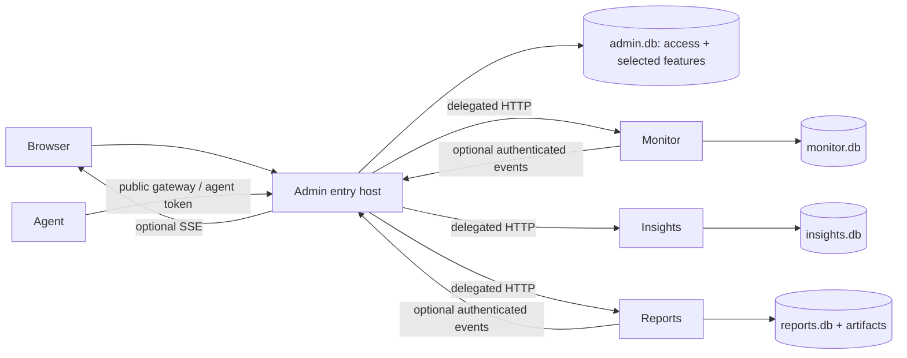
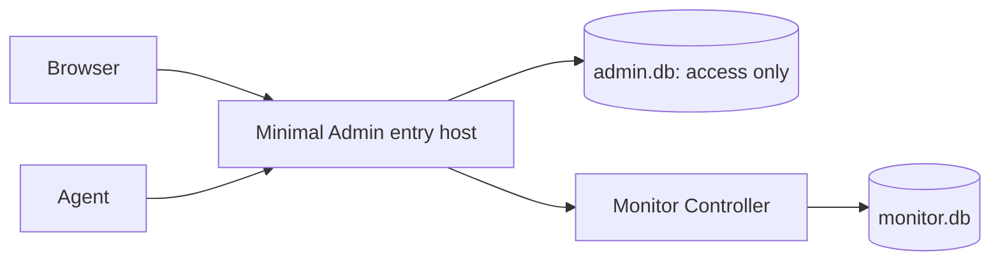

# Composable distribution architecture

Status: implementation underway; the P2 minimal Admin backend composition is implemented.
Native staging derives `buildId` from selection, build inputs and verified
contract digests, then publishes a private-root temporary tree under a fixed
exclusive lock after a final no-replace check. This is not a claim of protection
against a malicious same-UID writer outside that producer protocol.
Scope: one self-hosted installation, local SQLite databases, selected services
on one host; node Agents may run remotely.

## Decision

Retain the existing process and database boundaries, make the Admin entry host
small by default, and derive every distribution artifact from one resolved
build selection. Add optional durable notifications inside that host. Do not
introduce a notification microservice, generic service discovery, or a second
authorization system.

Three alternatives were evaluated:

| Alternative | Benefit | Cost / failure | Decision |
| --- | --- | --- | --- |
| Full binaries plus environment switches / Compose profiles | Small change, convenient development | Unselected routes, schema and Web assets still ship; does not meet physical absence | Rejected as product delivery |
| Minimal entry host plus selected existing services | Reuses auth/delegation, data ownership and process isolation; two processes for monitoring | Requires real Admin/Web/schema pruning | Selected first implementation |
| Standalone module binary embedding shared identity and Web shell | One server process for monitoring | Requires shared identity persistence, two security ingress modes and duplicated lifecycle assembly unless carefully extracted | Defer until a concrete one-process requirement justifies it |

Process count is not the measure of modularity. A minimal authenticated gateway
is an explicit prerequisite; optional Admin product behavior is not. If a
single-process target later becomes required, reuse the same business library
and capability declarations through a dedicated composition entry point, with
separate security tests. Do not add it speculatively now.

## Runtime views





The second diagram is the `monitor` preset. There are no Insights, Reports,
notification, release UI or task-management processes or features hidden behind
it. Authentication is still enforced on user requests. Agent credentials remain
separate from user credentials and internal producer credentials.

The P2 source boundary is available as `rustzen-admin` with
`--no-default-features --features monitor-distribution`. It uses a dedicated
fresh Admin schema and registers only the access routes, selected navigation and
Monitor gateway. The selected Web artifact and native installation remain later
release gates, so this feature build alone is not a deployable monitor package.

The entry host is a dependency of browser access and Agent ingress. Separate
processes do not make collection independent of that entry. Initially retain
the existing single public ingress; a direct public Monitor endpoint would add
another TLS/rate-limit/security boundary and is not selected without a measured
availability requirement.

| Failure | Defined result |
| --- | --- |
| Entry stopped, Monitor running | User access and new Agent ingress fail; Monitor keeps committed history and its missing-report evaluator; no claim of continuous fresh collection |
| Monitor stopped, Entry running | Login/access works; Monitor requests including Agent ingress fail unavailable; no fabricated accepted report |
| Notifications unavailable | Producer business operation continues within local storage limits; optional events follow the bounded relay contract |
| Entry and Monitor recover | Only accepted fresh reports advance liveness; missing intervals stay missing, not reconstructed as normal samples |

Current Agent behavior is a 30-second collection/send cycle and a 5-second HTTP
timeout, retaining its sequence on failure but collecting fresh data next cycle.
It has no durable sample spool and does not replay every missed sample. Preserve
that declared best-effort collection contract in this composition refactor.
An incident for missing reports indicates loss of observed reporting, not proof
that a remote server powered off. Show last accepted report time and data gaps.

An offline Controller-pairing gate binds a published Agent to a signed Monitor
Controller declaration. `rz pin-monitor-controller` writes a root-owned,
canonical profile after release and protocol verification; deployed production Agent startup reads
it before logger or network construction. This certifies only the declared
offline pair. It does not contact the endpoint or install users, units, tokens,
or runtime activation.

## Node-Agent activation

Activation follows apply, access preparation and Controller pairing. `rz
activate-monitor-agent --config <root-only-file>` validates the signed current
payload, fixed profile and root-owned source config, then atomically publishes
only `/opt/rz/config/rz-monitor-agent.env` as `root:rz-monitor-agent 0640` and
installs the exact selected native Agent unit. The unit is independent of
`rz.target`. Production config requires production mode, a node ID, a canonical
Controller URL exactly equal to the profile endpoint, and a non-placeholder
Agent token. The token is neither placed in the profile nor output or logs.

The selected Agent unit declares fixed systemd state and log directories and passes a
fixed runtime root to the process. The service identity can write only those
systemd-managed directories; `/opt/rz` stays root-owned except for read-only
configuration group access required at startup.

Production uses systemctl daemon-reload, enable and start for that exact unit.
A fixture may use a debug/test recorder seam. It does not claim readiness from
a started process: readiness requires an accepted or duplicate real report.
PID1 enable/start/restart remains deployment verification work.

Monitor owns final Agent-token verification. Initially keep the current
installation-wide shared Agent secret, supplied in Monitor/Agent configuration;
the entry only forwards the dedicated header on the exact Agent-report route
and enforces transport limits. It neither stores Agent identity in admin.db nor
reads monitor.db. Installation generates a nondefault random secret and the
operator provisions trusted Agent nodes. Rotation replaces the Monitor secret
and distributes the replacement to Agents through operator-managed config;
old credentials are rejected after Monitor reload/restart. This revokes all
holders, not one node. Per-node cryptographic identity/enrollment/revocation is
not claimed by the current shared-secret model and would require a separate
Monitor-owned credential contract. No browser or user JWT can substitute for
this credential.

## Source ownership and extraction

| Location | Target responsibility | Change type |
| --- | --- | --- |
| `apps/admin/src/infra/app.rs` | Explicit composition of access core, selected local features and selected gateway routes | Refactor |
| `apps/admin/src/features/auth`, `account`, permission infrastructure | Keep essential identity local; remove dependencies on optional log/task/deploy features | Refactor |
| `apps/admin/src/features/notifications/` | Inbox persistence, recipient policy, event ingestion and realtime adapter | New |
| `apps/admin/src/features/modules/` | Registry of installed modules only, not every known module | Extend |
| `apps/monitor/` | Existing business behavior; optional transactional notification publication | Extend |
| `apps/reports/` | Existing runs/schedules; optional terminal-event publication | Extend |
| `apps/web/` | Shared shell plus a generated, selected-only route and API graph | Refactor |
| `crates/ipc/` | Existing route/delegation contract; separate typed internal event contract used by producers and Admin | Extend |
| `crates/auth/` | Shared token/context/capability mechanisms; no notification or feature SQL | Reuse / extend |
| `crates/config/`, `storage/`, `runtime/` | Selected-owner config, storage mechanics and runtime layout | Extend narrowly |
| `distribution/` | Authored finite capability catalog and presets | New design target |
| `scripts/` | Bun selection resolver, generators, inventory and verification commands | New / replace focused scripts |

The SSE connection hub initially has only one runtime owner: Admin. Keep it
under that feature rather than creating an unconsumed public crate. Promote
`rustzen-realtime` when a second real embedding host needs the same connection,
queue and lifecycle semantics. Multiple event-producing modules prove reuse of
the event contract, not reuse of the connection hub.

Do not move module SQL or status enums into IPC. Each module may expose a Rust
library target for tests or later embedding without losing its application
ownership. No dynamic plugin ABI is introduced.

The current Monitor executable combines controller and Agent modes. Split its
composition into controller and Agent binary targets with explicit dependency
boundaries before certifying an Agent-only package. Reuse protocol and collection
code, but the Agent target must not link controller routes, controller SQLite,
Admin or Web initialization. Renaming or repackaging the combined executable
does not satisfy the Agent-only absence gate.

Define `artifactClass` as `server` or `node-agent` in selection and installed
identity. Server presets always select the controller-only target, with no
Agent mode, collector initialization, Agent config or unit. The `node-agent`
class selects only its collector/protocol/client and node service lifecycle.
Neither side can be certified by testing absence on the other side alone.

## Closed access foundation

This inventory is a source-to-owner boundary, not a second authored route
catalog. Concrete paths and permissions remain exported by Rust registration.

| Dimension | Access owns | Optional owner / exclusion |
| --- | --- | --- |
| Journeys | Bootstrap owner, login/logout, own profile/password, user/role/grant administration, session revoke, selected navigation and unavailable state | General dashboard, module toggles/menu presentation and avatar upload belong to admin-console |
| Route families | Auth; account profile/password; system users/roles; read-only selected navigation/capability options; installation inventory; selected module gateway; health/Web shell | Menu mutation, dashboard, system status, modules enable/disable, deploy/tasks/log browsing are conditional optional registrations |
| Web roots | Login, profile without optional avatar actions, user/role settings, root shell, 403/404, selected landing/navigation | Optional dashboard, menu/module/status, deploy/task/log pages are absent |
| Tables | users, roles, user_roles, selected code-owned menus and role_menus used for grants, selected modules, session/revocation metadata, access_security_audit, schema identity metadata | No dicts, operation_logs, tasks, deploy, notification tables or optional module_navigation presentation overrides |
| Seeds | Bootstrap identity/role and selected code-derived capabilities/menu descriptors; no absent module rows | No independently mutable menu editor in the minimal build |
| Background work | Selected module manifest/health refresh, access-cache/session cleanup, bounded security-audit cleanup | No generic task engine, deploy worker, log collection/export or absent-service polling |
| Config/secrets | Entry bind/TLS deployment reference, local admin DB/log path, password/JWT/session settings, only selected-module endpoints and delegation keys | No absent-owner secret; no Agent secret stored by Access; notification ingress keys only with notifications |
| Audit | Security actions: login outcome, logout/revoke, user status/password and grants; bounded metadata only | No audit browsing/export endpoint or UI in minimal Access |

Use the existing grant-table naming where useful; a `menus` row used for a
selected code-defined capability does not imply shipping the menu editor.
Source fields, API models and startup imports must follow the same owner split,
including optional avatar storage. Do not copy a second user/role implementation.
Prevent removal/disablement of the last enabled owner through every access path.

First owner creation is local-only. Before opening the public listener, the
installer invokes the selected Admin executable's nonresident `init-owner` mode
as the installation service owner, reading operator-supplied credentials from
stdin or a private file, never command-line arguments or a shipped default.
Admin alone initializes its DB and atomically inserts the owner/grant plus a
permanent bootstrap-complete marker. There is no public bootstrap/claim route.
Concurrent attempts yield one creation; later attempts and restarts cannot
reopen bootstrap. An existing installation with inconsistent owner state fails
closed for explicit local recovery; it never exposes first-user registration.
The installation executor delegates to the DB owner rather than opening admin.db.

All user/role/membership/grant mutations that could remove an effective owner
use one access-owned write primitive with `BEGIN IMMEDIATE`, bounded busy handling
and full rollback on failure. Check the actor and post-mutation enabled-owner
count inside that transaction, including role deletion/disablement, bulk grants,
self-demotion and user deletion/status changes. A zero count returns a conflict
without commit. No controller-side preflight COUNT substitutes for this invariant.

Access security audit retains at most 30 days or 10,000 rows, with each record
at most 1 KiB. Cleanup runs in bounded batches and drops oldest audit records
at capacity, recording a constant-size eviction count. Never include passwords,
tokens or raw request bodies. Invalid-login auditing is rate-limited. Storage
failure is explicit; do not claim this small audit log is a compliance archive.

`admin-console` owns selected service health/version/configuration summaries;
`log-console` owns operation-log browsing and selected-service log tail/export/
cleanup. Log-console declares its own routes and does not require the general
status dashboard. Shared read-only service health needed by the gateway remains
in access; UI diagnostics and log files are not interchangeable owners.

## Build selection: one authored input, several derived contracts

The authored catalog contains feature IDs, dependencies, owning packages,
frontend entry roots, schema fragments, assets and service specifications. It
does not duplicate HTTP routes or permission declarations, which remain
code-derived. The preset selects feature IDs; a resolver computes their finite
dependency closure and rejects unknown IDs, cycles, missing required features
and unsupported combinations.

Before authoring this catalog, freeze an independent current-behavior inventory
from the designated source/dirty snapshot and existing product contracts. Cover
journeys, route operations, Web entries, background tasks, DB objects, config,
units, installed files and CLI behavior. Each item maps to exactly one capability
or a named shared infrastructure owner. Orphaned items, duplicate owners and
unexplained removals block full-build acceptance. The full distribution must
match this independent baseline plus explicitly new target behavior; a catalog
cannot prove its own completeness. Unused legacy schema is an explicit removal
decision backed by reachability evidence, not an invented product requirement.

Illustrative future selection, not an executable current command:

```toml
schema_version = 1
preset = "monitor-notify"
capabilities = ["access", "monitor", "notifications"]
target = "x86_64-unknown-linux-musl"
```

Capability rules:

- Every Web distribution includes `access`.
- `monitor`, `insights` and `reports` select their service, routes, pages and
  schema as a unit. A module's internal features are not arbitrary switches.
- `notifications` requires `access`; producer adapters are generated only for
  selected producers. `monitor` never implicitly selects notifications.
- `admin-console`, `release-ui`, `task-admin` and `log-console` require access
  and explicitly list any other necessary behavior. They cannot be smuggled in
  through an umbrella dependency.
- Reports scheduling is part of Reports and does not require Admin task-admin.
- Full selects every supported capability explicitly, rather than using a
  runtime wildcard with an unknown future expansion.

Two identities serve different purposes. `compositionId` hashes the normalized
capability contract version, artifact class and sorted resolved feature IDs; it excludes source,
release version, preset alias and toolchain. It identifies the stable product
combination. It is not permission to reuse an older build's data. Current
execution follows the fresh-only rule in [implementation](implementation.md).

The resolved build plan also records exact package/features, route roots,
migrations, assets, services, toolchain, target, version and source content.
Its canonical JSON is hashed as `buildId`, identifying a build plan, not proving
output-byte equality. Actual file/Web hashes are recorded in the signed manifest
to avoid a self-referential hash. Outputs use
`target/distributions/<buildId>/<target>/`; no variant can reuse an unqualified
`apps/web/dist` as proof of matching content. A source fix changes `buildId`
without changing `compositionId` when the product combination is unchanged.
Record allowed build-time environment inputs, generator/tool versions and
generated-file hashes in provenance. Unknown ambient inputs fail the controlled
release build. If repeated builds of one plan produce different output hashes,
record the difference and reject reuse/overwrite of that artifact directory;
do not assume identical plan IDs prove reproducible outputs.

Stages:

1. Resolve authored selection and validate dependencies.
2. Generate selected Web route imports, local feature registration, known module
   registry, schema baseline and service/config templates.
3. Export the selected API contract through a nonshipped contract-only Rust
   target using the same registration/features as the final host; it does not
   initialize databases or require embedded Web. Generate selected Web clients,
   build Web, derive its digest/stamp, then build final Rust targets embedding
   those assets. Re-export the final host contract and require exact equality
   with the pre-Web export, closing the build-order dependency without a second
   hand-authored API catalog.
4. Export actual compiled routes/capabilities, OpenAPI operations/components/
   scopes, config fields/env names, CLI commands, startup hook/task/timer IDs,
   schema, generated files/cfg/env/native links and dependency inventories.
5. Compare actual inventories and dependency graphs with the resolved plan.
6. Package exactly the enumerated files; reject extra entries and path escapes.
7. Generate the canonical manifest core from resolver output, verified selected
   Web inventory bytes and binary/file byte reads. It discriminates server and
   node-agent inputs before packaging; signing and archive assembly consume its
   exact bytes only after their own P4 gates pass.
8. Generate and sign a release manifest binding all file hashes, build identity,
   schema fingerprints and composition identity.

This applies the OpenTelemetry Collector Builder's explicit-distribution idea
to this repository. It does not embed OpenTelemetry or create a plugin system.

## Cargo and frontend exclusion

Cargo features are additive. Use positive optional dependencies, empty defaults
for the minimal host and explicit `--no-default-features` in distribution builds.
Never express exclusion using a feature named `disable-reports` or assume a
workspace build proves a minimal variant. Use separate target/output directories
and inspect `cargo tree -e features` for each supported preset. Dev dependencies
and a repository-wide lockfile are not the shipped runtime closure.

Retain the current explicit workspace `resolver = "2"` and record the pinned
Cargo/Rust toolchain. Each plan item declares package, binary target, target
triple, exact features and dependency-edge default-feature policy. Build with
explicit `--package --bin --target --no-default-features --locked`; inspect
shared internal dependency edges for `default-features = false` where required.
Explicit binary declarations/required-features prevent auto-discovering an old
combined executable. Build separately per binary where one Cargo invocation
would union feature sets across owners. Empty application defaults alone do not
disable defaults transitively.

`cargo tree` is supporting resolver evidence, not proof of actual linking or
initialization. Validate each binary's compiled owner closure and emitted
registration/provenance, not just the whole preset's union. Include build.rs,
proc-macro generated files, rustc cfg/env and native links; a compile-time tool
may legitimately be shared, but its emitted runtime artifacts must stay within
that binary's selected owners. A forbidden sentinel in a default dependency,
OpenAPI descriptor, configuration field, daily timer or build output must fail
before packaging. Timers are inventoried at registration, not only by waiting
ten minutes for one to fire.

Admin local feature modules, routes, middleware, initialization hooks, background
tasks and optional dependencies must all be conditional at the same composition
boundary. Essential auth cannot import `features/manage/log` or initialize
deploy/task services; replace those dependencies with a small access-owned
security audit operation. Do not introduce a general event hook system.

Web tree shaking and lazy loading are insufficient by themselves: a lazy route
can still generate a shipped chunk. Generate a static route-entry file containing
only selected imports before TanStack route generation. Exclude unselected route
roots from the generator input. Remove broad API barrels, search indexes,
navigation imports and assets that reintroduce excluded modules. The implementation
must prove the emitted asset graph, including lazy chunks and source maps,
contains no unselected product entry or runtime dependency.

Resolve explicit TanStack `routesDirectory`, `generatedRouteTree` and `tmpDir`
under the plan's generated workspace. Populate the route directory from the
selected route-file allowlist, including its required root/layout files; it is
the plugin's only discovery input. No default scan of the full source route
directory and no write to the shared tracked routeTree.gen.ts is allowed during
a distribution build. Keep alias/import resolution explicit and verify resulting
imports rather than relying on filename exclusions alone.

Set Vite `publicDir` to an assembled selected-only directory (or disable it).
Its as-is copy is not controlled by import tree shaking. Include public assets,
workers, CSS URLs, locales, search registries, precache inputs and source maps
in emitted inventories. No Service Worker is introduced by this design.

Generate typed clients from the selected contract export. Every frontend action
declares owner and operation ID; its emitted operation inventory must be a
subset of the final backend operations with matching method/path/input/output
schema fingerprints. Handwritten wrappers use those descriptors; a generic HTTP
helper is not permission to construct unregistered product URLs. Binding/auth
bootstrap operations have an explicit access-owned contract too. Include the
selected API-contract digest in Web build inputs so contract drift changes the
paired output. This checks compile-time API compatibility separately from the
runtime Web-byte binding.

Package selected Web assets into the matching host binary only. Define
`webDigest` over a canonical path/hash list of emitted Web files, using the
unstamped HTML with a fixed empty binding slot. Then inject the digest into
that slot; the final signed file inventory covers the resulting HTML bytes too.
This avoids hashing a digest into itself. Embed the same digest in the backend.
The browser reads its HTML binding stamp and compares it with anonymous
`GET /__web-binding` before loading the app entry or accepting credentials;
authenticated `/api/installation.webDigest` agrees with the same value.
`buildId` is only additional
diagnostic context. Use content-addressed assets and entry integrity checks to
prevent stale asset substitution. A same-plan/different-content mismatch is
still rejected. Runtime capabilities can restrict, but never add, compiled code.

Use a small inline access-owned bootstrap in the HTML itself, so a missing old
entry chunk cannot prevent mismatch recovery. HTML and binding responses use
`Cache-Control: no-store`; hashed assets use immutable caching. Only after a
matching response does the bootstrap load the entry module with its expected
integrity. A mismatch or failed entry load permits one cache-busting root reload
per attempted transition, preserving a validated local deep link. If the second
attempt fails, show a static retry/error view without credential or business
requests; do not reload forever. Network failure follows the same fail-closed
view. This contract covers distributions built with this bootstrap, not arbitrary
legacy HTML that never implemented it. Previously cached bytes are not claimed
to be physically erased from the user's browser.

## Route, permission and navigation consistency

Admin-native contract registration and `ModuleRouter` remain route authorities.
The distribution catalog selects owners, not individual HTTP paths. Generated
known-module IDs replace fixed arrays in module state, health, CLI and navigation.
An unknown/uninstalled module has no registry entry and receives 404. An installed
service with a missing/unhealthy manifest is unavailable and receives 503.

The capability catalog and role seeds are generated from selected route
registration/Manifests. Owner wildcard authorizes registered behavior only.
Unselected capabilities do not appear in roles, menus, search or UI queries.
Signed build-time module metadata allows installed navigation to remain visible
before a temporarily unavailable service starts; live manifests must match its
release and contract identity before the gateway routes traffic.

Keep three independent layers:

1. Installed inventory: immutable, signed product composition.
2. Runtime operational state: selected service available/unavailable/disabled.
3. User authorization: whether this user can access installed behavior.

The optional Admin module console may disable an installed module but cannot
install a missing one. Minimal presets omit that console. System status and
health enumerate selected services only.

After binding, page guards resolve: uninstalled route 404, unauthenticated login,
unauthorized 403, authorized but unavailable 503, then content. Unknown API
namespaces likewise return 404 without SPA fallback; installed protected APIs
require authentication before exposing runtime state. No service diagnostic is
shown to an unauthorized user. On an observed auth/permission-generation change,
abort affected requests, clear owner/user query caches, ignore late responses
from the old generation, and rematch navigation before rendering cached content.
Revalidate access on focus and before a protected navigation. Installation default
landing is Monitoring for the monitor preset; actual user landing is its first
authorized selected root, otherwise permitted access settings or own profile.

## Persistence

Each service remains sole owner of its database. Split Admin's fresh-install
baseline into authored feature-owned fragments and assemble one deterministic
initialization baseline for each selection. SQLx receives that generated baseline,
not a full schema followed by DROP statements. Do not suppress SQLx checksum
validation or ignore missing migrations to accommodate variants.

The build records an ordered fragment list and resulting schema fingerprint,
plus each owner's `dataContractId` for durable value domains, serialization,
seed semantics and artifact formats. DDL equality alone is not data compatibility.
Startup compares the installed manifest and DB metadata before background tasks
start. A nonempty database with a different fingerprint is rejected without
mutation. Only selected fragments run; seeds contain installed module and
capability rows. Monitor's and Reports' separate notification outbox fragments
are included only when the distribution selects notifications with the
corresponding producer. Reports keeps the nullable immutable
`initiator_user_id` in its base fresh run schema; a pure Reports schema retains
that harmless run provenance field but has no outbox, delivery ledger or relay.

Build one scratch database per selected owner from the exact baseline. Exercise
selected repository/query paths against it, including dynamic SQL (used in the
current source). If query macros/offline metadata are used, bind their schema
and metadata to buildId plus owner; reject fallback to full-workspace metadata.
This is a query/schema integration gate, not a requirement to rewrite every
query as a macro. A full-only table reference must fail the monitor gate.

Each fragment declares its ID, capability owner, dependencies, created objects,
permitted references and seed namespace. References to dependency-owned tables
are allowed; altering, dropping, adding triggers to or seeding another owner's
objects requires an explicit shared extension owned by that dependency. Compare
scratch tables/indexes/triggers/immutable seeds with those declarations and the
independent full baseline. Duplicate or unexplained objects fail the build.

For each owner, derive dataContractId from a small canonical descriptor of
persisted discriminants, state domains, serialization versions, immutable seed
meanings and artifact formats. Code-to-descriptor fixtures validate the current
fresh baseline; historical-reader compatibility fixtures are out of scope.
Hashing a descriptor does not discover arbitrary semantic bugs: the owner must
review durable read/write changes and update current conformance fixtures.
A different build uses a fresh root, with no conversion policy.

Every database has an owner-local singleton identity: owner, composition, build,
baseline ID, schema fingerprint and dataContractId. The signed manifest is the
expected authority. Before a normal pool, PRAGMA mutation, migrator, listener or
background task, acquire the owner lifecycle lock and open an existing DB with
no-create/read-only options. Compare identity, the exact SQLx ledger, and a
canonical observed schema inventory with the expected contract. The inventory
sorts object type/name/table/SQL and column/index/foreign-key metadata, excluding
only an explicit SQLite-internal allowlist; row data and mutable grants are not
schema. Never run pending migrations on an existing DB. Wrong owner, unexpected
objects or an incomplete ledger fail without product schema/data/ledger writes.
Do not use immutable mode on a possibly live WAL database. A database requiring
write recovery is left stopped for an explicit owner-controlled recovery action.

Fresh means the final path is absent; an existing empty, unknown or partial file
is not silently deleted. Initialize a private sibling staging DB under the owner
lock using transactional fragments only. Complete schema, ledger, selected seeds
and identity, then integrity/foreign-key checks; close/checkpoint and fsync before
atomic no-replace publication and parent-directory fsync. Never overwrite a final
DB. A failed staging file stays isolated for bounded installer-owned cleanup.
Admin's owner bootstrap completes in this staging database before publication;
credentials never enter the installer journal. A crash leaves the final path
absent or complete. A multi-service fresh install becomes ready only after all
selected owners publish, without a cross-database transaction.

Keep physical database ownership unchanged (`admin.db`, `monitor.db`, etc.).
Changing filenames merely for architectural symmetry would add migration work.
No cross-database SQL joins, foreign keys, shared SQLite connection pools or
read access by another service. Report artifacts exist only in Reports builds.

## Internal events and live delivery

Business transactions write durable events only for lifecycle changes requiring
inbox history. The producer's relay reads committed outbox rows and calls the
Admin internal event endpoint. It has a bounded batch, concurrency, exponential
backoff and shutdown deadline. A successful response means Admin committed its
receipt/message, not that a user received or read it.

Do not reuse the existing Admin-to-module user-delegation signature unchanged
for reverse event publication: its method/path/user semantics and body binding
are different. Use an explicit producer contract with producer ID, timestamp,
nonce, exact method/path and body digest covered by a per-producer HMAC key.
Internal ingress listens on a loopback-only listener; public ingress must not
forward it. The feature adds an optional listener, not another service.

The Admin transaction implements persistent deduplication. A repeated ID with
the same payload is a successful duplicate; the same ID with a different
payload is a conflict. Recipient projection is policy-owned by Admin; producers
cannot grant permissions or inject arbitrary recipients. Recheck current
authorization on listing, unread-count queries, live dispatch and detail access.

SSE is advisory invalidation. Use fetch streaming with the current Bearer
scheme, a protocol-compliant parser, cancellation, retry backoff and a bounded
per-connection queue. Do not put JWTs in URLs. No global per-user filtering of
every event, unbounded channels, or durable replay promise from an in-memory
sequence. On initial connection/reconnect, refresh current inbox state.

Authentication expiry and user/session revocation must close existing streams;
handshake checks alone are insufficient. A minimal session/revocation generation
belongs to access, with bounded connection revalidation. Multiple tabs may
initially each hold a bounded connection; SharedWorker is a measured optimization,
not a first-release dependency. Desktop notifications are separately opt-in and
do not provide delivery after every page is closed without a Web Push design.
The precise session model and signed-request admission boundary are defined in
[contracts](contracts.md); roles are never trusted as frozen JWT grants.

## Install, configuration and lifecycle

Keep native Linux/systemd as the first delivery owner. Generate `rz.target`,
service units, recovery checks, directory list, config and installer inventory
from the selected release manifest. There must be no Wants/After/health-check
dependency on omitted services. Do not accidentally turn a module failure into
an Admin failure through `Requires`/restart propagation.

Each installed service reads only its own selected configuration. Secrets are
split by service identity and provided at installation; absent-owner variables
are not required. Monitor-server activation is an explicit second
fresh-root phase: it verifies the selected payload, publishes two service-local
environment files and units, streams the owner secret to Admin's offline bootstrap as the Admin identity,
starts `rz.target`, checks both health endpoints, then enables the target before
recording readiness. It rejects known Reports/Insights units, enablement, config
and runtime roots before the first activation write. No full-layout recovery or
unselected service is part of that phase.
The phase uses a root-only continuation journal for the two fresh SQLite
publications and removes it only after the ready marker is durable.
Optional internal notification ingress is created only when selected. Installation trust,
release directories, current link, journal, lock, launcher and unit files are
root-owned and writable only by the local privileged executor. Each resident
service has its own non-root User/Group, writes only its data/log/profile paths,
and reads only its own secrets (pairwise keys are intentionally shared by their
two endpoints). No shared runtime user grants Admin access to module databases.
init-owner and runtime fixtures run under the final service identity.

The initial selected-native artifact is generated from the reviewed native
source, rather than adapting the legacy shared-configuration deployment
templates. Monitor server output names only its target/Admin/Controller units
and two consumer-scoped config files; node-agent output names only its Agent
unit and Agent config file. The release manifest derives the native layout byte
digest and includes it in the build identity. Installer publication remains a
later closure.

Record selected host-runtime prerequisites in the release manifest and native
installation profile. Reports currently launches an external Chromium process;
full/reports therefore require a tested browser executable/version, supporting
OS libraries/fonts and a writable private browser-profile/artifact directory.
The release records the certified Linux distribution/architecture and exact
browser test version. Installation preflight checks availability and the Reports
health gate launches a bounded local fixture through its generated systemd unit,
with the final User/Group, environment, sandbox and paths. No implicit
browser download or privileged script fetched from the network is allowed.
An offline Reports delivery includes its separately inventoried browser runtime
and dependencies, or is explicitly ineligible as an offline package. Monitoring
never packages or probes browser dependencies. A Rust musl target alone is not
evidence of Reports host-runtime compatibility.

Compose, if added as a distribution adapter, must be generated with selected
services and images only; profiles alone are not physical exclusion. Container
paths cannot assume host loopback reaches another container. A Compose adapter
must explicitly implement private networking, producer authentication and
per-owner volumes before being declared supported. It is not an initial gate.

Release identity binds version, target, selected capabilities, current schema/data
contracts and exact files. Fresh apply rejects an occupied destination or conflicting
service names/ports before mutation. A different build or composition uses a new
installation root and new data; old roots are preserved and never read or converted.
No historical executable/data rollback or compatibility allowlist is generated.

P8 certification has a separate fail-closed admission step. It derives the
selection from the finite catalog, asks each real producer about the exact
capability closure and composition identity, and reports missing producer
families before any expensive build. A custom selection is never admitted by
resemblance to a named preset.
The admission result contains no artifact digest and cannot be consumed as a
release certificate; later source/build, native, runtime, browser and load
reports each bind their own immutable inputs.

P8d consumes an admitted Monitor plan only through the retained
`VerifiedContainerExportSnapshot` and a verified signed release triplet. It
derives source identity, tree digest, toolchain, build ID, binary and full
manifest inventory from those inputs; no CLI digest, tree, toolchain or manifest
claim is accepted. The issuer returns an unforgeable publication capability;
the publisher writes one canonical, no-replace
`source-build-certificate/source-build-manifest.json` beside the immutable
release with stable reread and an exact one-file certificate directory.
It does not install, create `current`, start systemd or certify Agent, browser,
load or deployment work.

The first P8b build-batch closure is a Linux/amd64 BuildKit export for the
admitted `monitor` server selection only. It requires the musl target and a
caller-supplied source-identity input. The caller selects `--platform
linux/amd64`, and the export producer rejects any other runtime platform without
changing the shared full-build stage. It then writes exactly two roots: `release`
and `witness`. `release/server/bin` contains only `rz-admin` and `rz-monitor`;
`witness/bin` contains only `rz-monitor-agent`. The latter is read only for the
Controller/Agent protocol comparison and is outside the server payload.

Within that same build stage, the selected Web producer emits its inventory and
`dist` under `release/web`; API, fresh-schema, selected-config, reviewed
protocol and native-layout producers write beneath `release/contracts`. Every
binary-facing producer receives an explicit temporary release binary root made
from the already-built Linux executables. It must not invoke Cargo, use a debug
target or receive a fixture helper. The terminal export records canonical
`release/output-manifest.json` over the payload and
`release/container-provenance.json` with the raw selection input and digest,
source-identity input, `rustc -Vv`, target triple, Linux/amd64 platform and
exact Cargo command arrays. These files are batch evidence only: they neither
issue a source-build certificate nor sign, publish, install or mark a release
current.

A host-side P8b validator consumes the exported directory as one stable,
descriptor-checked snapshot and retains the verified bytes for its caller. It
parses only canonical output-manifest and provenance records, resolves the
authoritative caller selection and accepts an explicit expected source-identity
input. It never accepts a caller-provided digest, toolchain claim or certificate
claim. On macOS or any other host it does not execute exported Linux binaries:
it parses their ELF64 little-endian headers and program headers, requires
`EM_X86_64`, `ET_DYN` and no `PT_INTERP`, then checks the compiled
`RUSTZEN_RELEASE_MARKER` for the exact expected binary. The fixed musl target
and recorded static Cargo flags bind the target claim; a stripped ELF alone does
not prove a libc implementation.

The planned canonical `source-build-manifest` has exactly `source`, `build`
and `artifact` certified layers. It binds the source identity/tree digest,
toolchain/build ID/binary digests, and manifest/archive/envelope digests. Its
four later-layer booleans are permanently false: native runtime, browser journey,
load and `releaseReady`. The production release gate must continue to reject a
plan until separate immutable evidence satisfies every later layer; certificate
creation never writes a `current` pointer. The schema and expected-input verifier
exist before the issuer: no certificate is emitted until one orchestrator captures
the real source/toolchain, verifies one stable release snapshot and publishes the
result with crash-safe no-replace semantics.

The nonresident rz installation executor owns apply/status/recover independently
of Admin deploy tables. The current recovery slice resumes only interrupted
fresh payload publication for the same exact revalidated archive, envelope and
manifest tuple, or leaves it stopped with diagnostics. Its root-owned sibling
journal records the verified tuple, publication phase and a random work-root nonce.
Before payload writes it creates and fsyncs a root-owned descriptor-relative marker
with that nonce; only a matching journal and marker authorize cleanup of that work
root. The permanent publication marker records that same complete tuple and nonce,
so either cleanup boundary can converge after a crash without accepting another
tuple. Persist intent before each side effect, recheck actual state, use one
exclusive lock and never overwrite an unrelated destination. A later closure may add manager reload, writer admission
and readiness phases; they are not inferred from this journal. If the journal or
tuple differs, fail closed without database mutation. No existing product database
is restored or deleted.

Native artifact staging is builder-created, current-user-private and quiescent. Its
same-descriptor `O_NOFOLLOW` and identity checks detect ordinary replacement and links,
but do not claim portable `openat`-grade protection against a hostile same-UID writer.
Untrusted archive extraction safety remains an installer closure.

The first implemented executor slice covers detached-triplet verification,
strict archive admission, dry-run, fresh-root publication, read-only status and
same-tuple fresh-root payload continuation. It deliberately stops before
service-manager reload/start and database initialization; those boundaries stay
pending rather than being inferred from a published filesystem layout.

Keep the reviewed trust boundaries: private root staging, same-file-object signature
verification/extraction, descriptor-relative no-link writes, exact content digests,
per-service non-root identities and root-only trust/unit/journal ownership. A stable
launcher outside the product current link invokes the exact verified executor;
a damaged executor leaves recovery stopped rather than selecting an older version.
For Monitor P4, recovery is journal-driven fresh-root continuation for the same
archive/envelope/manifest tuple only. It does not introduce `rz-recovery.service`,
does not extract the full DeployService, and cannot roll back or restore databases.
`rz.target` contains only Admin and Monitor; reload the service manager after unit
publication and reject mixed unit/executable identities. Online-update recovery is a
later, separate executor closure.

Optional release-ui remains a restricted caller for signed-bundle staging and
explicit fresh-destination installation. It must not imply retaining data across
builds. Its immutable request binds request ID, target build, archive/manifest/
envelope hashes and a server-issued fresh destination identity. The executor,
not a user-supplied path or shell argument, resolves that identity beneath its
managed installation root. A content-addressed no-replace spool and root-side
recheck precede any side effect. Same request ID with a changed tuple conflicts.
Only the fixed one-shot installation-request unit may be started by Admin's
unit-specific OS policy; no general privileged command is exposed. A single
accepted job may continue if Admin stops, with sanitized read-only status.
Absent release-ui means no request spool, unit, privilege rule or HTTP action.
New-owner initialization remains local/private and must finish before readiness.

These fresh-install decisions supersede the historical replacement/rollback
alternative retained in the ten-round review record. The existing fixed release
implementation is not silently removed by the catalog slice; its replacement
belongs to P4, with explicit changed journey expectations and native validation.

## Operating limits and failure isolation

- Each selected service has its own process, DB, logs and restart boundary.
- Notifications cannot synchronously delay incident detection or run execution.
- Outbox and inbox retention/size limits are explicit, with a visible failure
  signal and bounded logical notification storage. Shared DB/WAL/filesystem
  usage needs operational headroom; reliability is bounded, not "never lose".
- An absent notification feature allocates no relay, table, SSE queue or timer.
- An unavailable notification consumer leaves events pending within the
  retention/capacity window; replay does not duplicate inbox records.
- Minimal build acceptance includes idle process/RSS/disk measurements, but no
  reduction percentage is claimed before measurement.
- Selected services are local; cross-host control planes, remote SQLite files,
  multiple active writers and clustered SSE are unsupported initially.

See [contracts](contracts.md) for normative error/retention details and
[validation](validation.md) for the tests that make these claims reviewable.

Monitor P4 keeps the Controller and Agent pair at one wire boundary: both
binaries expose the same descriptor and digest, while request delivery remains
through the Admin gateway. Pairing rejects unequal digests before a selected
release can combine their artifacts.

### Selected API producer

Contract-only Admin and Monitor commands execute before dotenv, configuration,
database, or runtime initialization. Admin maps `documented_all_contracts()`;
Monitor builds its `ModuleDefinition` and `routes()` manifest through one shared
helper. The selection producer requires the exact reviewed Admin and Monitor
owner, route, access and menu corpus, then writes a composition-qualified
`contracts/api/api.json`. The release manifest hashes the canonical bytes it reads
from that artifact.

The selected schema producer reads the final Admin Monitor and Monitor
initialization migrations, records their byte hashes under the exact resolved
owners, and derives versioned data-contract IDs from those hashes. The release
manifest reads only canonical `contracts/schema/schema.json` bytes through the
same stable-file boundary; callers cannot supply schema hashes or data IDs.

Selected configuration originates beside the three real Config definitions.
Admin, Monitor Controller and Monitor Agent expose versioned descriptors before
dotenv startup. Descriptors contain keys, types, requirement/default classes and
named secret references, never environment values or secret literals.
The producer combines exact reviewed descriptors into a composition-qualified
`contracts/config/config.json`; Monitor server contains `access` and `monitor`
(and adds `notifications` for the notification composition), while Agent contains
only `monitor-agent`. Manifest generation reads those
canonical bytes through the stable-file boundary and derives `configDigest`.

The protocol producer uses the same stable single-file boundary. Both compiled
Monitor targets emit the descriptor; their canonical descriptor/digest pair must
match each other and the reviewed golden before a composition-qualified protocol
artifact is published. The manifest derives the pairing ID and build input from
that artifact, preventing caller substitution.

### P8b captured-byte native staging

The next P8b closure accepts only a `VerifiedContainerExportSnapshot` returned by
the host validator. It derives the Monitor selection, source identity, recorded
toolchain and selected routes from retained snapshot records, never from CLI
claims. It copies only `release/server/bin/*`, `release/contracts/*` and
`release/web/dist/*` into a private build-qualified staging tree as `bin/*`,
`contracts/*` and `web/*`; the witness Agent, Web inventory, output manifest
and provenance are excluded. It recreates units from `nativeUnitBytes` and
checks their paths and hashes against the retained native-layout artifact. The
release manifest is then made by stable reread of that newly published staging
tree, never by reopening the container export root. This closure does not sign,
publish a release, install, create `current`, or run systemd.

### P8c captured-byte signed release

P8c takes the retained `VerifiedContainerExportSnapshot` through P8b staging
and reuses the selected-release publisher to create one immutable signed
triplet. Its final directory contains only `archive.tar`,
`release-manifest.json` and `signature-envelope.json`, each a `0644` regular
file. The publisher rereads and verifies that triplet against the independently
supplied public key before returning it. The private key is a local signing
input, read through a no-follow stable-file boundary; it is never embedded in
the staging tree, archive, manifest, envelope, logs or CLI JSON output.

P8c does not establish a certificate authority, install a release, alter
`current`, create systemd state, start a process, or prove browser/load work.
